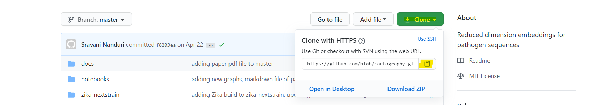
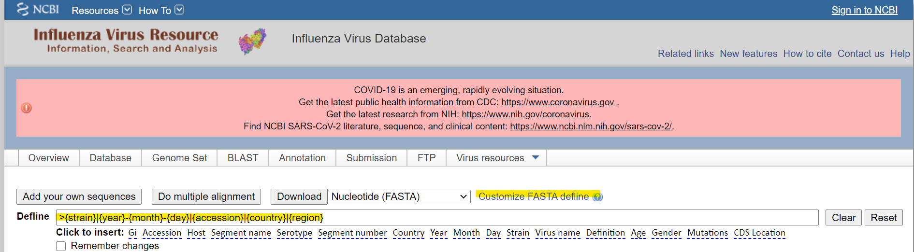

# Cartography
Reduced dimension embeddings for pathogen sequences

## Running the entire build

Hello and welcome to Cartography! This is all the source code for the paper Cartography written by Sravani Nanduri. In order to run the build from start to finish, there are some dependencies that much be installed.

### Running the Cartography YAML File
All these dependencies for this project can be installed via Conda (install conda [here](https://docs.conda.io/en/latest/miniconda.html) ) by running:

```
conda env create -f cartography.yml
```
To check the environment was created, run 

```
conda-env list
```
If "cartography" is listed as one of the options, you've created the environment successfully! The asterisk will show you which environment you're currently running. 

If you're running the snakemake build, there's no need to activate the environment - it does it for you. However, if you're running the evironment on its own, activate the new environment by running:

```
conda activate cartography
```
### Creating a Local Repository of Cartography
In order to work with this data and create the paper, you'll need to clone the data. 
You'll first need github for your desktop. Go [Here](https://git-scm.com/book/en/v2/Getting-Started-Installing-Git) for instructions on how to install github on your computer. Once github has been installed, click on the "Clone" button on the top of this repository in green, and click the clipboard icon. This allows you to copy the github repository link to your computer.



Go back to your prompt, and navigate to a good repository to put your files (remember, "cd" allows you to type a path in, and "../" allows you to step back a directory). 

As a note to windows users, do not put the repository in your "Users" folder - it will cause a Unicodeescape error while running the snakemake file. Finally, type 

```
git clone https://github.com/blab/cartography.git 
```
and wait for the repository to be created. Check to make sure everything worked by typing 

```
cd cartography
```

and making sure the file location exists. Congratulations on creating a local version of the repository! Your work is almost done. 

### Getting Data from NCBI for Flu

Go to the link posted [here](https://www.ncbi.nlm.nih.gov/genomes/FLU/Database/nph-select.cgi?cdate_has_day=true&cdate_has_month=true&cmd=show_query&collapse=on&country=any&fyear=2018&go=database&host=Human&lab=exclude&lineage=include&niaid=include&qcollapse=on&searchin=strain&segment=4&sequence=N&showfilters=true&sonly=on&subtype_h=3&subtype_mix=include&subtype_n=2&swine=include&tyear=2020&type=a&vac_strain=include) . This link will give you the parameters needed to get the correct data from the NCBI Influenza Database. Click the "Customize Fasta Defline" button next to the download and input

```
>{strain}|{year}-{month}-{day}|{accession}|{country}|{region}
```
It should look like this: 


After customizing the defline, click "download", and download the data into the "data" folder of the "seasonal-flu-nextstrain" folder in your local repository of Cartography. Name the file "ncbi-h3n2-ha.fa". 

Thats it! All the data has been downloaded. Now it's time for the snakemake file do all the work. 

### Running the Snakemake File

Navigate to your cartography repository in your shell prompt, and type 

```
snakemake -p --cores 1 --use-conda
```

Let the snakemake file run! It is pretty memory intensive and takes a bit of time, so give the script time to completely run. Once it's done, navigate into the "docs" folder, and all the graphs, charts, and papers should all be created in the folder. You're done!


# Running the build manually

If you'd like to run separate parts of the build, you can definitely do so. 

Creating the paper itself is done using pandoc. The .bib file in the "docs" folder contains the citations, and the index.md contains the analysis and actual content of the paper. To put them together, simply navigate in your shell to the "docs" folder, and type 

```
pandoc --filter pandoc-citeproc --bibliography=cartography.bib -s index.md -o cartography.html 
```
for the html version of the paper, or 
```
pandoc --filter pandoc-citeproc --bibliography=cartography.bib -s index.md -o cartography.pdf 
```
for the pdf version. 


Running the builds for the trees can also be done separately. 

For zika, navigate into the "zika-nextstrain" folder, and type 

```
snakemake -p --cores 1 --use-conda
```
and let the build run. The JSON tree will be in the created "auspice" directory named "zika-cartography_tree.json". 

For H3N2 Ha influenza, navigate into the "seasonal-flu-nextstrain" directory in your shell, and type 

```
snakemake -p --cores 1 --use-conda
```
and let the build run. The JSON tree will be in the created "auspice" directory named "flu_seasonal_h3n2_ha_2y_tree.json".