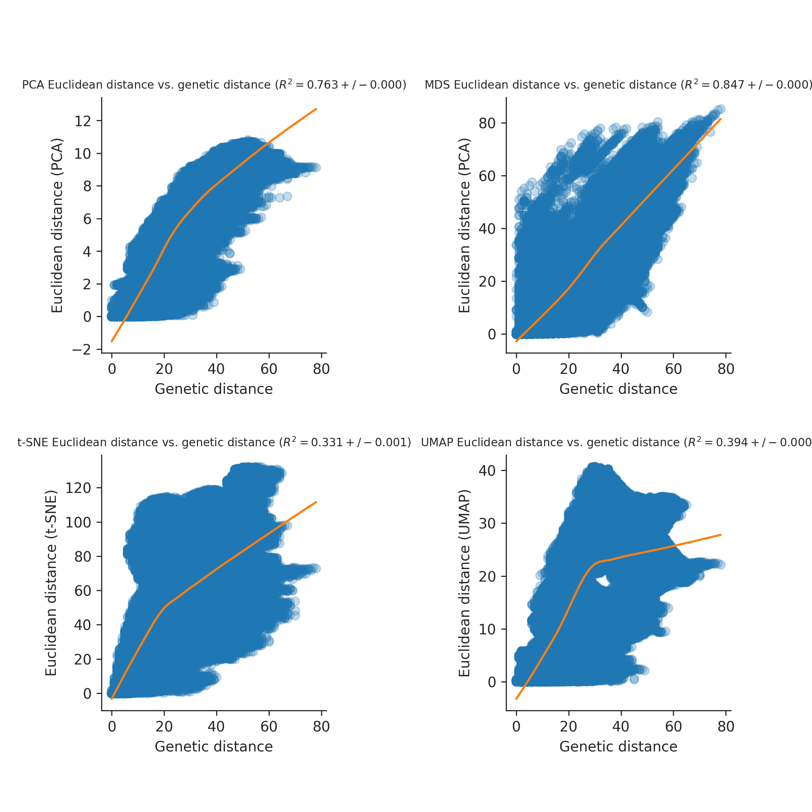
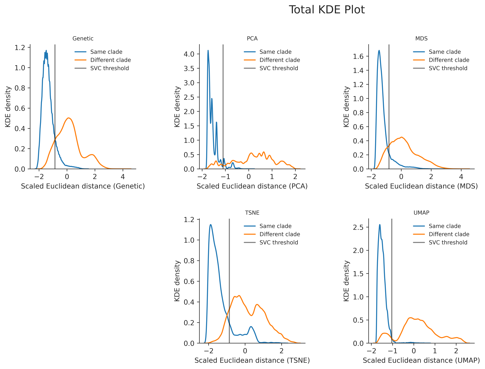
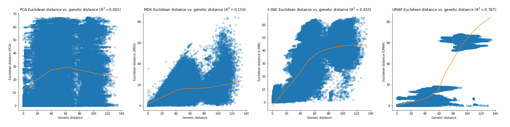
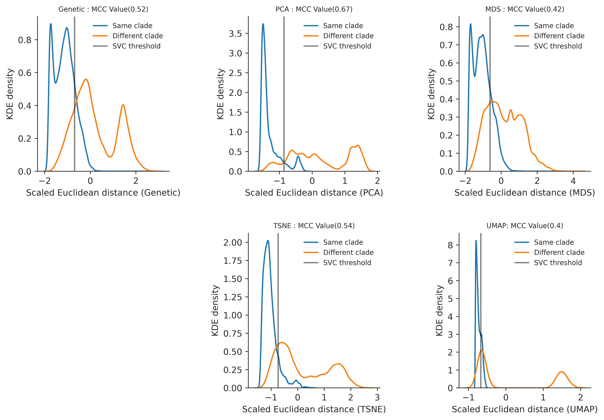

# Introduction

Phylogenetic inference is a fundamental tool for understanding genealogical relationships among human pathogenic viruses.
However, recombination and reassortment of viral genomes invalidates basic phylogenetic assumptions of inheritance and requires more sophisticated approaches.
One approach is to split a genome into multiple phylogenies to model the evolution of the nonrecombinant fragments.
This is done using a genetic algorithm that scans strains for recombination breakpoints, quantifies and analyzes the impact of recombination at each one, and splits the phylogeny at its most important breakpoints [@kosakovsky_pond_posada_gravenor_woelk_frost_2006].
Finding recombination breakpoints relies on the detection of a recombination signal through methods such as CHIMAERA and LARD.
Both CHIMAERA and LARD use split decomposition, a method which depicts parallel edges between sequences if there are conflicting phylogenetic signals in the data [@Posada13757] [@martin_murrell_khoosal_muhire_2017].

An alternate strategy is to compare viral genomes with alternative methods that do not make the same strong assumptions as phylogenetic inference (e.g., PCA, MDS, etc.).
PCA has been used to estimate and model ancestry in unrelated individuals and plot peoples genomes to reveal patterns in national origin [@alexander_novembre_lange_2009] [@GenesMirrorGeography2008], and was also used to genotype major classes of structural variants - structural differences such as deletion, duplication, and novel sequence insertion - in diverse populations to map their population stratification [@sudmant_1000_gene_paper].
PCA was also used to reveal Zika’s genetic diversity and spread in the Americas by assessing clustering of multidimensional genetic data [@H.C.109348].
Principal component analysis (PCA) was consistent with the phylogenetic observations, and showed tight clustering in Zika genomes in strains from the same geographical introduction.
MDS has been applied to h3n2 sequences to inspect relationships between all gene segments, which is closely related to the subject of this paper, for the difference that Rambaut et .al. 2008 looks at between-gene diversity rather than within-gene [@rambaut_pybus_nelson_viboud_taubenberger_holmes_2008].
The MDS analyses showed tight clustering between genes, which suggested that the evolutionary dynamics of influenza A virus is shaped to some degree by phylogenetic history and global epidemiological dynamics.
PCA, t-SNE, and UMAP have all been used to better capture both discrete and continuous patterns of variation in human genomes across a genetic continuum, and the embeddings were able to show relationships between genotype, phenotype, and geography [@diaz-papkovich_anderson-trocmé_ben-eghan_gravel_2019].

While Diaz-Papkovich et.al. and Metsky et.al. explored qualitative measurements of embedding accuracy and fitness, this paper will go beyond that by establishing quantitative measurements as to the fit and accuracy of the embeddings to further bridge the gap between visualization and statistical testing.
This paper will also give insight into different reduction techniques, and will discuss both their limitations and strengths in the realm of viral data.
We present a novel approach to understanding relationships among viral genomes by transforming genomic data and then using dimensionality reduction methods such as PCA, MDS, t-SNE, and UMAP.
We investigate the degree to which this method can recapitulate known phylogenetic relationships for viruses whose genomes are phylogenetically tractable (we used influenza h3n2 HA and Zika, with of evolutionary rates of around 4.04 × 10^-4 (95% HPD: 1.32 × 10^-4, -7.41 * 10^-4) and 9.57 * 10^-4 (95% Highest Posterior Density: 8.28 - 10.9 * 10^-4) subs/site/year respectively).
We apply this method to viruses whose genomes are known to undergo substantial recombination, such as MERS (evolutionary rate of around 5.15×10^-3 (HPD 4.62 * 10^-3, -5.70 * 10^-3) substitutions/site/year).) and SARS-CoV-2 to assess how well each method is able to reconstruct previously identified biologically-meaningful clusters.

Recombination: occurs when at least two viral genomes co-infect the same host cell and exchange genetic segments.
Shuffling/reassortment, a particular type of recombination, occurs in viruses with segmented genomes, which by interchanging complete genome segments, gives rise to new segment combinations [@pérez-losada_arenas_galán_palero_gonzález-candelas_2014].

# Results

## Expectations for PCA, MDS, t-SNE, and UMAP

Principal Component Analysis (PCA) reduces multidimensional data, increasing interpretability while minimizing information loss[@jolliffe_cadima_2016] .
PCA relies on linear assumptions, does not affect the scale of the data, and does not normalize the data as part of the algorithm.
PCA preserves long range distances but hides finer-scale details.
Because PCA is almost entirely focused on retaining the global structure and variance of the data, and one of its limitations is revealing patterns locally.
PCA is not an algorithm to be used on a similarity matrix, and is instead intended for transformed and normalized multidimensional data.
In the context of this paper, PCA will be used on transformed and normalized genetic data and not on the similarity matrix described above.

Multidimensional Scaling (MDS) refers to statistical techniques that reduce the complexity of a data set by quantifying similarity judgments, which increases the interpretability of local relational structures mired in the dataset [@hout_papesh_goldinger_2012] .
A limitation to MDS is that only one symmetric matrix is allowed as input, and the scale of measurement is non-numerical.
MDS preserves global patterns over local, but the algorithm’s importance on translating dissimilarity to distance does preserve some larger patterns in local structure as well.
In the context of this paper, MDS will cluster data into sparse “sections” of the map while not creating actual clusters.

t-distributed Stochastic Neighbor Embedding (t-SNE) visualizes high-dimensional data by giving each datapoint a location in a 2 to 3 dimensional map.
t-SNE is focused largely on local structure over global structure, and t-SNE’s projection of clusters and distances between clusters are not analogous to dissimilarity - in other words, t-SNE focuses heavily on projecting similarity rather than dissimilarity [@maaten2008visualizing].
Because t-SNE reduces data’s dimensionality based on local properties of data, data with intrinsically high dimensional structure will not be projected accurately.
In the context of this paper, t-SNE will create tight clusters that clearly indicate genetic similarity, but will not create an accurate global picture of the data.

Uniform Manifold Approximation and Projection (UMAP) is a manifold learning technique for dimension reduction based in Riemannian geometry and algebraic topology [@lel2018umap].
The end result is a patchwork of low-dimensional representations of neighbourhoods that groups genetically similar strains together on a local scale while better preserving long-range topological connections to more distantly related strains.
Some limitations include its lack of maturity - this novel technique does not have firmly established or robust practices and libraries to use UMAP best.
In the context of this paper, UMAP will reveal a tightly clustered set of data that retains both the global structure of the data and the clusters and similarities present at the local level.

## Expectations for Influenza

h3n2 Influenza in this project is used as a proof of concept as h3n2 HA influenza only reassorts and does not recombine.
The genomes are 1701 bases long, with a mean bases missing of .045217 and median of 0.
h3n2 Influenza is a seasonal, global disease where the clades are defined by mutations from other strains, making it the most compatible with the Hamming Distance algorithm used to reduce the embeddings detailed in the methods.
We use h3n2's HA sequences as they have a relatively high mutation rate compared to the other gene segments, it encodes a protein that is a target of human immunity, and has traditionally been used for analysis of influenza evolution.
As these sequences are biologically relevant, short, and do not recombine, the genomes can be reasonably assigned to phylogenetic clades.
Therefore, it can be assumed that h3n2 HA influenza is a good test case for Cartography.
We infer that the clusters pulled out by the embeddings will closely correspond to the clades on the phylogenetic tree, and we also expect that the embedding will reveal patterns within phylogenetic clades by clustering more finely within the larger clusters.

## Embedding clusters recapitulate phylogenetic clades for seasonal influenza A/H3N2

All four dimensionality reduction methods qualitatively recapitulated clade-level groupings observed in the phylogeny (Figure 1).
Strains from the same clade appeared tightly grouped in PCA, t-SNE, and UMAP embeddings and more loosely clustered in the MDS embedding.
Closely related clades tended to tightly cluster in PCA, MDS, UMAP, and, to a lesser extent, t-SNE.
For example, the clade A2 (orange) and its subclade A2/re (red) map to adjacent regions of all four embeddings.
We observed the same pattern for A1 (purple) and its subclade A1a (pink) as well as for A1b (brown) and its subclades A1b/135K (gray) and A1b/135N (blue).
The clade 3c2.A (red) and its subclade A3 (light blue) clustered in all embeddings except t-SNE.
This result matched our expectation that t-SNE would preserve local clusters and not retain global structure between more distantly related data.

To quantify the patterns we observed in Figure 1, we calculated two complementary metrics for each embedding method.
First, we measured the linearity of the relationship of Euclidean distance between two strains in an embedding space and the genetic distance between these same strains.
All four methods exhibited a consistent linear relationship for pairs of strains that differed by no more than 30 nucleotides (Figure 2).
PCA and UMAP provided the strongest linear mapping to genetic distance (Pearson's R2 = 0.693 and 0.615, respectively).
This same mapping for the MDS method was less of a linear function (Pearson's R2 = 0.468) than a piecewise function of two parts.
Strain pairs with fewer than 30 nucleotide differences were not as well separated in MDS space as strains with greater genetic distances.
This result suggests that MDS might be most effective for distinguishing between more distantly related strain pairs.
t-SNE's mapping was the weakest (Pearson's R2 = 0.269) and revealed that only closely related strains map near each other in t-SNE space.
Pairs of strains that differ by more than 15 nucleotides are unlikely to placed near each other in a t-SNE embedding.

Second, we determined how accurately the Euclidean distance between pairs of strains in an embedding could classify those strains as belonging to the same clade or not.
Specifically, we used a support vector machine (SVM) classifier to identify an optimal Euclidean distance threshold that distinguished pairs of strains from the same clade.
To train the classifier, we used the Euclidean distance between all pairs of strains as a one-dimensional feature and a binary encoding of within (1) or between (0) clade status as a model target.
As there were far more pairs of strains from different clades, we measured classifiction accuracy with the Matthew's correlation coefficient (MCC), a metric that is robust to unbalanced counts in the confusion matrix (citation here).
As a control, we compared the accuracy of each method's classifier to the MCC from a classifier fit to genetic distance between strains.
t-SNE and PCA provided the most accurate classifications (MCC = 0.73 and 0.68, respectively) and outperformed pairwise genetic distance (MCC = 0.65) and UMAP (MCC = 0.63, Figure 3).
MDS performed poorly (MCC = 0.41), confirming our expectations based on MDS's piecewise linear relationship with genetic distances.
These results show the potential benefits of using t-SNE embeddings for cluster analysis over the computationally simpler genetic distance, despite the t-SNE's lack of global linear relationships between strains.

## Figure One

<iframe src="https://blab.github.io/cartography/FullLinkedChartBrushableFlu.html" style="width: 1200px; height: 400px;" frameBorder="0"></iframe>

## Figure Two

## Figure Three

## Expectations for Zika

Zika: Zika in this project is used as a test case.
While h3n2 Influenza is a globally distributed virus that has caused infections seasonally for decades, Zika is a fairly new human pathogenic virus that has a restricted geographic distribution that recapitulates the patterns of viral transmission.
Therefore, while Influenza's clades were defined by mutations, zika's clades were defined by significant geographical introductions and outbreaks.
Because of the difference in the definition of a clade, we used Zika to determine if the embeddings can not only recapitulate mutational but also geographical significance within its clustering.
The genomes are 10769 bases long, with a mean bases missing of 913.613 and median of 154.
With a longer genome and possible recombination, it can be reasonably assumed that zika is a good test case for Cartography.
We infer that the embeddings will reveal outbreak patterns, but with less defined clusters than Influenza.

## Embedding clusters reveal outbreak and geographical patterns within Zika

All four dimensionality reduction methods recapitulated phylogenetic patterns observed in the phylogeny (Figure 1).
PCA, after imputing missing data, had a similar global structure to the findings in Metsky et.al., where the clades were featured on a continuum of shifting between clades instead of tightly clustered as seen in Influenza.
Geographical introductions and outbreaks isolated from the others were placed at larger euclidean distances than related introductions.
An example is clade c2, an outbreak in Singapore and Thailand separated from the other geographical introductions in the Americas.
Clade c10 is also a good example of a densely sampled outbreak in Colombia (introduced from Brazil) that forms distinct clusters in all the embeddings.
PC1 and PC2 dileneate the variance between c2 and the other clades (Americas v Asia), and PC3 and PC4 are used to show the variance between clade c4 and c3 compared to clade c6 and c9 (variance within the Americas).
HDBSCAN performed on PC1 and PC2 was able to define clusters of outbreaks not noted in the phylogenetic tree, such as a small Brazil-only outbreak as well as a cluster from China and Samoa.
Clade c3 was the parent of all Americas outbreaks; in the tree this clade is split into multiple sections, with clades c7, c5, c9, c6, and c4 being children of that outbreak.
Therefore, clade c3 clustered into multiple sections within each embedding, with these clusters correlating to different outbreaks within the parent clade c3 (the most notable being in PC3 and PC4, as well as t-SNE)
Clade c9 is a second parent (with clade c10) of an outbreak in Brazil that spread to the US Virgin Islands and Puerto Rico, where c6 is a child outbreak of c9 that also spread to neighboring countries.
All four of the embeddings recognized their similarities and placed the clades in close proximity to each other.
Clade c4, which is a Central American outbreak that spread to Puerto Rico and other neighboring countries, was not placed closely to clades c6 and c9 even given similar geographical locations and introduction times.
t-SNE and UMAP also recognized a smaller cluster within clade c7 by placing it farther away from the rest of the embedding, which was a subset of a larger outbreak which spread into North America from Brazil.
These results suggest that genetic dissimilarity reduced via t-SNE and UMAP can be used to distinguish outbreaks from eachother without imputation, which rivals PCA's sensitivity to missing data.
Strain pairs were not as well separated in MDS space, but MDS did loosely cluster clades with genetically and evolutionarily distant clades farther away (Clade c1, the strains dated in 2013-2014).
This result suggests that MDS does better with unimputed data than imputed, as the genetic distance normalization process is robust to gaps.

According to the Genetic vs Euclidean distance scatterplots, all four methods exhibited a piecewise linear relationship for pairs of strains that differed by no more than 50 nucleotides (Figure 2).
For larger than 50 nucleotide difference in genetic distance, PCA, t-SNE, and UMAP increase much faster in a piecewise fashion, revealing that these embeddings are using local patterns to map genetically distant strain combinations farther away for better visualization.
This is the expectation for t-SNE and UMAP, but is surprising to see in PCA.
PCA and UMAP provided the strongest linear mapping to genetic distance (Pearson's R2 = 0.573 +/- .002 and 0.580 +/- .002, respectively).
The UMAP mapping revealed two different clusters of points in the scatterplot, which is the stark Euclidean distance differences between clade c2 and the other strains due to its isolated sampling.
This clustering is only seen in UMAP, revealing UMAP's sensitivity to large amounts of outliers in the embeddings quality.
The same mapping for MDS was the weakest and non linear(Pearson's R2 = 0.253 +/- .002).
No strains were placed far away from eachother with MDS' loose clusters.
t-SNE's mapping was fairly strong (Pearson's R2 = 0.522 +/- .002) and revealed that pairs of strains that differ by more than 50 nucleotides are unlikely to placed near each other in a t-SNE embedding.

Just as in Influenza, t-SNE and PCA provided the most accurate classifications (MCC = 0.56 and 0.52, respectively) and outperformed pairwise genetic distance (MCC = 0.51) and UMAP (MCC = 0.37, Figure 3).
UMAP performed incredibly poorly, which we attribute to the incredible distance between clade c2 and the other clades, which may have caused the classifier to misrepresent the euclidean threshold between and within clades (FN: 7934 vs FP: 49397).
MDS performed poorly (MCC = .34), confirming our expectations based on MDS's piecewise linear relationship with genetic distances.
These results corroborate our previous conclusion about the potential benefits of using t-SNE embeddings for cluster analysis over genetic distance.

## Figure Four
<iframe src="https://blab.github.io/cartography/FullLinkedChartBrushableZika.html" style="width: 1200px; height: 400px;" frameBorder="0"></iframe>

## Figure Five

## Figure Six

## Expectations for MERS

MERS: MERS in this project is used as a extreme test case.
MERS is a virus spread between species, with camel to human to human outbreaks.
MERS is a recombinant virus, and there are observed departures from strictly clonal evolution, suggesting that recombination is an issue for inferring MERS-CoV phylogenies.
While its effect on human outbreaks is minimal, as humans are transient hosts with a smaller probability for co-infection, its effect is exacerbated in camel outbreaks.
While Influenza's clades are defined by mutations and Zika's by significant geographical introductions, MERS clades were assigned to internal nodes and tips in the tree based on monophyletic host status (strictly camel or human) to reveal patterns within host outbreaks.
The genomes are 30130 bases long, with a mean bases missing of 889.781 and median of 42.5.
With a long genome, recombination, missing bases, and mutliple hosts, it can be reasonably assumed that MERS is a good case to test and challenge Cartography.
Because MERS clades are defined by outbreak, we infer the embeddings will behave similarly to Zika, with clustering by outbreak and host status.

## SUMMARY OF RESULTS FOR MERS

## SUMMARY OF RESULTS ACROSS VIRUSES

PCA is incredibly senstive to missing data, which is the larger issue of using sites on a genome as features.
While PCA can therefore be used to pull out low quality strains, we had to remove all the low quality samples through imputation, dropping strains, and thorough inspection of the data to create a useful PCA embedding.
The advantage of UMAP and t-SNE over PCA is their robustness to missing data while preserving similar, if not better, quality results.
t-SNE performed the best out of the embeddings at finding outbreaks, newly created clades, and local patterns in general.
While UMAP has been used extensively recently in genomic studies, we reccomend the use of t-SNE for a most robust embedding to outliers and other sample quality issues extrapolated within the UMAP embedding that are not in t-SNE.
This paper has systematically and quantitatively demonstrated the usefulness, accuracy, and usages of these embeddings in viral epidemiology, something not done until now.
It has opened a gateway for its usage in practical applications in the future, especially since the code and analysis used for this paper have been made public, easy to use on other datasets, and will be onboarded into neststrain-augur for ease of use.
The hope is that scientists will now be able to use these embeddings to further understand their dataset and diseases.

# Discussion

# Materials and methods

The analysis environment can be recreated using conda and all installation instructions are available on [Cartography’s github](https://github.com/blab/cartography) .

The genome data we used for h3n2 HA influenza is from the NCBI Influenza database.
We used [this search](https://www.ncbi.nlm.nih.gov/genomes/FLU/Database/nph-select.cgi?cdate_has_day=true&cdate_has_month=true&cmd=show_query&collapse=on&country=any&defline_saved=%3E%7Baccession%7D%20%7Bstrain%7D%20%7Byear%7D/%7Bmonth%7D/%7Bday%7D%20%7Bsegname%7D&fyear=2015&go=database&host=Human&lab=exclude&lineage=include&niaid=include&qcollapse=on&searchin=strain&segment=4&sequence=N&showfilters=true&sonly=on&subtype_h=3&subtype_mix=include&subtype_n=2&swine=include&tyear=2020&type=a&vac_strain=include). Clades were defined by reasonable phylogenetic signal.
The Zika data was curated by Allison Black, with sequences from Genbank and the Bedford Lab. Clades were defined by regionally important introductions as well as by reasonable phylogenetic signal in terms of mutations on branches.
The MERS data was downloaded from [e-life](https://elifesciences.org/download/aHR0cHM6Ly9jZG4uZWxpZmVzY2llbmNlcy5vcmcvYXJ0aWNsZXMvMzEyNTcvZWxpZmUtMzEyNTctZmlnMS1kYXRhNS12My56aXA-/elife-31257-fig1-data5-v3.zip?_hash=YhuQfm%2BGO%2BY6MsWLZB4WrPQvYtSlHOhLnzwnvTaesws%3D), which was split into a Newick tree and Aligned FASTA file. [@dudas_carvalho_rambaut_bedford_2018]

Clades and host were used in the MERS analysis, as the hosts, camel and human, are scientifically useful and phylogenetically accurate to the Newick tree.
The clade assignments were taken from the newick tree created in Gytis' and Bedford's paper [@dudas_carvalho_rambaut_bedford_2018].
We analyzed Influenza A/h3n2 and Zika by creating a FASTA file of multiple sequence alignments with MAFFT v7.407 [@Katoh2002] via augur align [@Hadfield2018] and phylogenies with IQ-TREE v1.6.10 [@Nguyen2014] via augur tree version 9.0.0.

We used two different methods of transforming the data; Scaling and centering the data, and a Hamming distance similarity matrix.
For Scaling and Centering the data, we performed PCA on the matrix of nucleotides from the multiple sequence alignment using scikit-learn [@jolliffe_cadima_2016].
An explained variance plot was created to determine the amount of PCs created, which is in the supplementary figures section.

We dropped around 4 strains in the h3n2 analysis, as they were direct animal to human transmissions where the genomes resembled swine flu (seen through NCBI's BLAST)
We dropped around 5 strains in the Zika analysis that were exceedingly low quality.
Due to the amount of missing data within the zika genome, we also imputed the data using scikit-learn's simple imputer for PCA in order to get a better embedding result. This was only applied to PCA, as the hamming distance algorithm disregards missing bases.
While imputation was originally used on all 4 embeddings for Zika, they were robust enough to missing bases to reveal patterns on unimputed data.
Imputation was tested for MERS, but due to entire columns of missing data for MERS, imputing did not solve the issue of missing data for PCA.
We therefore dropped all strains with over 3 standard deviations of gaps in its genome from the MERS analysis.

For Hamming distance, we created a similarity matrix.
By comparing every genome with every other genome and clustering based on their Hamming distance, distance-based methods take the overall structure of the multidimensional data and groups together genomes that have similar differences.
This means the data is clustered by genetic diversity (in a phylogenetic tree genetic diversity is categorized using clades).
Each genome was split into separate nucleotides and compared with other nucleotides in the same site on other genomes.
We only counted a difference between the main nucleotide pairs (AGCT) -- gaps (N) were not.
This is because some sequences were significantly shorter than others, and a shorter strain does not necessarily mean complete genetic dissimilarity, which is what counting gaps implied.

We reduced the similarity distance matrix through MDS, t-SNE, and UMAP, plotted using [Altair](https://altair-viz.github.io/) ,and colored by clade assignment.
Clade membership metadata was provided by a .json build of the influenza h3n2 tree and zika trees. For MERS, the host data was given via the Newick tree.
The 3 different dimensionality reduction techniques are ordered below by publication date:
- [MDS](https://scikit-learn.org/stable/modules/generated/sklearn.manifold.MDS.html)
- [t-SNE](https://scikit-learn.org/stable/modules/generated/sklearn.manifold.TSNE.html)
- [UMAP](https://umap-learn.readthedocs.io/en/latest/)

The plots of the full 10 PCs for PCA and the first 6 components for MDS are available in the supplemental figures section.

We tuned hyperparameters for t-SNE and UMAP through an exhaustive grid search, which picked the best values by maximizing Matthews Correlation Coefficient on the confusion matrix created from a Supported Vector Machine's classification.
UMAP's minimum distance and nearest neighbors were tuned, and t-SNEs perplexity and learning rate were tuned as well.
As nearest neighbors fluctuates depending on the amount of samples, we took the best nearest neighbor value from the cross validation and the total number of samples given per fold.
The proportion value was used to determine the nearest neighbors value for the UMAP plots per disease.
t-SNE performed best with a perplexity of 15.0 and a learning rate of 100.0.
UMAP performed best with a minimum distance of .05 between clusters.
While tuning these parameters will not change qualitative results, it can help make patterns easier to identify.
For example, the more nearest neighbors, the higher the computational load, and while smaller minimum distances can break connectivity between clusters, they will not change the groupings of individuals.

We ran the raw embedding distances through the clustering algorithm Hierarchical Density-Based Spatial Clustering of Applications with Noise (HDBSCAN) to understand the usage of the embeddings to cluster data without the phylogenetic tree.

To further analyze these embeddings’ ability to accurately capture the multidimensional data, we made two separate plots: hamming vs euclidean distance scatterplots with a LOESS best fit line, and within vs between clade KDE density plots per embedding.

Hamming distance vs euclidean distance scatterplots:

Hamming distance vs Euclidean distance plots assess the local and global structure of the embedding as well as assess the overall strength of the embedding's recapitulation.
The Hamming distance between nucleotide sequences is plotted on the x axis, and the euclidean distance between the points in the embedding are plotted on the y axis.
By plotting these distance measurements, we can observe how correlated the dataset is.
The higher the correlation, the better a function can describe the relationship between the Hamming distance value and the euclidean distance value.
In this way, constant correlation in a plot reveals that the embedding tends to capture and retain local patterns rather than global, and a splayed structure points to global structure preservation over local.
Therefore, the closer the Pearson Coefficient is to 1, the better the embedding is at preserving genetic dissimilarity in euclidean space.
The LOESS line drawn through the plot assesses the best fit function for the embedding.
We bootstrapped our scatterplot to find the Pearson Coefficient with a confidence interval for more information.

Between vs Within clade KDE Density Plots:

The Between vs Within clade KDE Density Plots visually represent how well Euclidean distances can distinguish virus genomes from different clades.
In other words, it describes the probability that a certain Euclidean distance can be used to classify a given pair of genomes as within vs between clades.
The larger the median ratio between the two curves presented per clade relationship, the higher the relative probability that the embedding will accurately predict if two strains with any specific distance is a between or within clade relationship.
To create this plot, the matrix of euclidean distances for each embedding was flattened, and each comparison was labeled as a “within clade” or “between clade” comparison using the clade assignments from the .json build of the tree.
KDE plots were made using [seaborn](https://seaborn.pydata.org/) , separated by clade status and euclidean distance on the y axis.

## Supplementary Figures and Analysis

### Explained Variance Plots for PCA

##### Flu

##### Zika

##### MERS

### PCA Full Plots

##### Flu
<iframe src="https://blab.github.io/cartography/FullPCABrushSupplementFlu.html" style="width: 1200px; height: 400px;" frameBorder="0"></iframe>

##### Zika
<iframe src="https://blab.github.io/cartography/FullPCABrushSupplementZika.html" style="width: 1200px; height: 400px;" frameBorder="0"></iframe>

##### MERS
<iframe src="https://blab.github.io/cartography/FullPCABrushSupplementMERS.html" style="width: 1200px; height: 400px;" frameBorder="0"></iframe>

### MDS Full Plot:

##### Flu
<iframe src="https://blab.github.io/cartography/FullMDSBrushSupplementFlu.html" style="width: 1200px; height: 400px;" frameBorder="0"></iframe>

##### Zika
<iframe src="https://blab.github.io/cartography/FullMDSBrushSupplementZika.html" style="width: 1200px; height: 400px;" frameBorder="0"></iframe>

##### MERS
<iframe src="https://blab.github.io/cartography/FullMDSBrushSupplementMERS.html" style="width: 1200px; height: 400px;" frameBorder="0"></iframe>

# Works Cited
