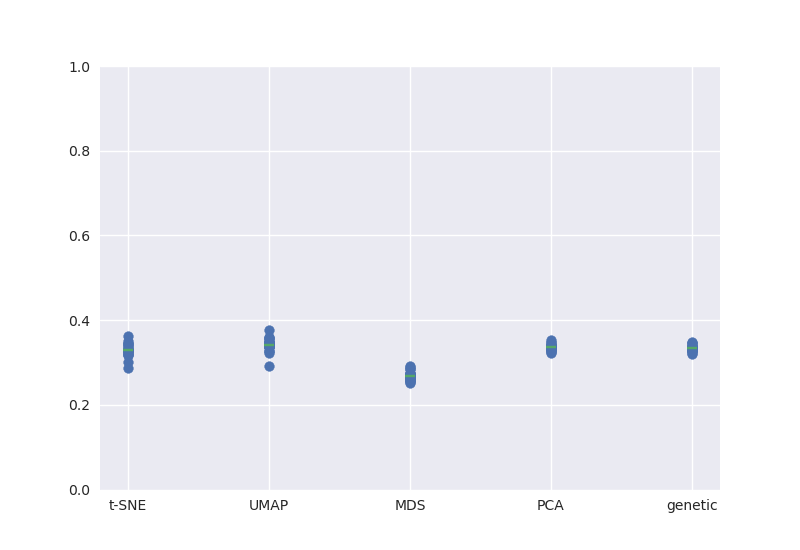

\pagebreak 

# Abstract

Phylogenetics is vital to epidemiologists' understanding of population patterns, dynamics, and transmission, and is integral to public health studies. Most diseases can be modeled in a transmission tree, an approach that tracks mutations in disease samples back to a single common ancestor; however, issues with sample quality, recombination, and other factors can make it difficult to quantify mutations of genetic sequences in reference to others. In this paper, we study the use of dimensionality reducing algorithms PCA, MDS, t-SNE, and UMAP in understanding viral population structure, and present quantitative and qualitative interactive visualizations that summarize the accuracy and scope of these models. With the public tools and automated code pipelines for ease of integration into other research projects, this paper will discuss the practical applications and future steps for this form of analysis and modeling within the scope of viral epidemiology. 

\pagebreak

# Introduction

Phylogenetic inference is a fundamental tool for understanding genealogical relationships among human pathogenic viruses.
However, recombination and reassortment in viral populations, the process of multiple viruses invading the same cell, which during cloning causes the viruses to exchange genetic material between each other, invalidates basic phylogenetic assumptions of inheritance and requires more sophisticated approaches [@pérez-losada_arenas_galán_palero_gonzález-candelas_2014].
One approach is to split a genome into multiple phylogenies to model the evolution of the nonrecombinant fragments.
This is done using a genetic algorithm that scans strains for recombination breakpoints, quantifies and analyzes the impact of recombination at each one, and splits the phylogeny at its most important breakpoints [@kosakovsky_pond_2006].
Finding recombination breakpoints relies on the detection of a recombination signal through methods such as CHIMAERA and LARD.
Both CHIMAERA and LARD use split decomposition, a method which depicts parallel edges between sequences if there are conflicting phylogenetic signals [@Posada13757; @martin_murrell_khoosal_muhire_2017].

An alternate strategy is to compare viral genomes with methods that do not make the same strong assumptions as phylogenetic inference.
Principal component analysis (PCA) has been used to visualize human population structure from genomic variants [@novembre_2008; @alexander_2009; @sudmant_2015].
PCA was also used to reveal Zika’s genetic diversity and spread in the Americas by assessing the clustering of multidimensional genetic data [@metsky_2017].
Principal component analysis (PCA) was consistent with the phylogenetic observations, and showed tight clustering in Zika genomes in strains from the same geographical introduction.
MDS has been applied to H3N2 sequences to inspect relationships between all gene segments, which is closely related to the subject of this paper, with the difference that @rambaut_2008 looks at between-gene diversity rather than within-gene.
The MDS analyses showed tight clustering between genes, suggesting that the evolutionary dynamics of influenza A virus is shaped to some degree by phylogenetic history and global epidemiological dynamics.
PCA, t-SNE, and UMAP have all been used to capture both discrete and continuous patterns of variation in human genomes across a genetic continuum, and the embeddings revealed relationships between genotype, phenotype, and geography [@diaz-papkovich_2019].
While @diaz-papkovich_2019 and @metsky_2017 explored qualitative measurements of embedding accuracy and fitness, this paper will go beyond that by establishing quantitative measurements for the fit and accuracy of the embeddings to further bridge the gap between visualization and statistical testing.
This paper will also give insight into different reduction techniques, and will discuss both their limitations and strengths in the realm of viral data.

We present a novel approach to understanding relationships among viral genomes by transforming genomic data and then using dimensionality reduction methods such as PCA, MDS, t-SNE, and UMAP.
We use interactive visualizations of the embeddings for a deeper exploration of patterns between the embeddings and the phylogeny.
We investigate the degree to which this method can recapitulate known phylogenetic relationships for viruses whose genomes are phylogenetically tractable, as well as the scope of this approach when considering the intrinsic variety in clade definition and viral transmission (influenza H3N2 HA and Zika). 
We apply this method to viruses with less samples, lower quality strains, and genomes known to undergo substantial recombination (MERS) to assess how well each method is able to reconstruct previously identified biologically-meaningful clusters.
We then expand the scope of the project with supplementary analyses that target understanding the use of these visualizations in outlier detection, pattern detection within a pathogen population over time, and its efficacy with reassortment.

# Results

+-----------+-------+-------+--------+---------+--------+------------+-------------+--------------+-------------+-------------+
|           |   MCC |    FN |     FP |      TN |     TP |   accuracy | embedding   |   medbetween |   medwithin |   threshold |
+===========+=======+=======+========+=========+========+============+=============+==============+=============+=============+
| Influenza | 0.695 | 10494 | 148951 | 1482126 | 196832 |      0.913 | umap        |        0.067 |      -1.447 |      -1.048 |
+-----------+-------+-------+--------+---------+--------+------------+-------------+--------------+-------------+-------------+
|           | 0.686 | 17174 | 138981 | 1492096 | 190152 |      0.915 | t-sne       |        0.087 |      -1.58  |      -0.952 |
+-----------+-------+-------+--------+---------+--------+------------+-------------+--------------+-------------+-------------+
|           | 0.682 | 11543 | 156132 | 1474945 | 195783 |      0.909 | pca         |        0.291 |      -1.671 |      -1.162 |
+-----------+-------+-------+--------+---------+--------+------------+-------------+--------------+-------------+-------------+
|           | 0.589 | 24887 | 201274 | 1429803 | 182439 |      0.877 | genetic     |        0.134 |      -1.438 |      -0.892 |
+-----------+-------+-------+--------+---------+--------+------------+-------------+--------------+-------------+-------------+
|           | 0.54  | 27326 | 243364 | 1387713 | 180000 |      0.853 | mds         |        0.039 |      -1.365 |      -0.832 |
+-----------+-------+-------+--------+---------+--------+------------+-------------+--------------+-------------+-------------+
| Zika      | 0.666 |  3432 |  21202 |  172525 |  29642 |      0.891 | pca         |        0.072 |      -1.434 |      -0.862 |
+-----------+-------+-------+--------+---------+--------+------------+-------------+--------------+-------------+-------------+
|           | 0.543 |  3686 |  36733 |  156994 |  29388 |      0.822 | t-sne       |       -0.198 |      -1.095 |      -0.736 |
+-----------+-------+-------+--------+---------+--------+------------+-------------+--------------+-------------+-------------+
|           | 0.519 |  5607 |  34180 |  159547 |  27467 |      0.825 | genetic     |       -0.063 |      -1.128 |      -0.688 |
+-----------+-------+-------+--------+---------+--------+------------+-------------+--------------+-------------+-------------+
|           | 0.421 |  6466 |  47447 |  146280 |  26608 |      0.762 | mds         |        0.088 |      -1.087 |      -0.616 |
+-----------+-------+-------+--------+---------+--------+------------+-------------+--------------+-------------+-------------+
|           | 0.404 |  7405 |  46961 |  146766 |  25669 |      0.76  | umap        |       -0.584 |      -0.747 |      -0.67  |
+-----------+-------+-------+--------+---------+--------+------------+-------------+--------------+-------------+-------------+
| MERS      | 0.712 |   197 |    754 |   32049 |   1191 |      0.972 | genetic     |        0.135 |      -1.865 |      -1.42  |
+-----------+-------+-------+--------+---------+--------+------------+-------------+--------------+-------------+-------------+
|           | 0.626 |   135 |   1466 |   31337 |   1253 |      0.953 | t-sne       |        0.02  |      -1.526 |      -1.372 |
+-----------+-------+-------+--------+---------+--------+------------+-------------+--------------+-------------+-------------+
|           | 0.625 |   234 |   1163 |   31640 |   1154 |      0.959 | mds         |       -0.117 |      -1.627 |      -1.27  |
+-----------+-------+-------+--------+---------+--------+------------+-------------+--------------+-------------+-------------+
|           | 0.473 |   317 |   2200 |   30603 |   1071 |      0.926 | umap        |        0.213 |      -1.24  |      -1.162 |
+-----------+-------+-------+--------+---------+--------+------------+-------------+--------------+-------------+-------------+
|           | 0     |  1388 |      0 |   32803 |      0 |      0.959 | pca         |       -0.489 |      -0.504 |     nan     |
+-----------+-------+-------+--------+---------+--------+------------+-------------+--------------+-------------+-------------+

: [All KDE values for each virus. MCC (Matthews Correlation Coefficient), FN (False Negative) FP (False Positive) TN (True Negative) TP (True Positive) accuracy(accuracy of the confusion matrix, TN + TP / total samples) threshold (z-score value the Support Vector Machine picked that best separates within vs between clade relationships) embedding (pca, mds, t-sne, or umap) between and within (z score values of the median of between clade and within clade KDE density curves, respectively)] {#tbl:KDE_full}

## Expectations for PCA, MDS, t-SNE, and UMAP

We have used four different methods commonly used in viral epidemiology for reducing our data, picked because of their varying ways of displaying data. 
Principal Component Analysis (PCA) reduces multidimensional data, increasing interpretability while minimizing information loss [@jolliffe_cadima_2016].
PCA is a matrix analysis method, while the other three methods reduce distance based comparisons. 
Multidimensional Scaling (MDS) refers to statistical techniques that increase the interpretability of local relational structures mired in the dataset [@hout_papesh_goldinger_2012].
t-distributed Stochastic Neighbor Embedding (t-SNE) projects clusters and distances between clusters that are not analogous to dissimilarity, as t-SNE focuses on projecting similarity over dissimilarity [@maaten2008visualizing].
Uniform Manifold Approximation and Projection (UMAP) is a manifold learning technique for dimension reduction [@lel2018umap].

<table class="tg">
<thead>
  <tr>
    <th class="tg-0lax">Method</th>
    <th class="tg-0lax">Benefits</th>
    <th class="tg-0lax">Disadvantages</th>
    <th class="tg-0lax">Sources/Citations</th>
  </tr>
</thead>
<tbody>
  <tr>
    <td class="tg-0lax">PCA</td>
    <td class="tg-0lax">- relies on linear assumptions, does not affect the scale of the data</td>
    <td class="tg-0lax">- focuses completely on global patterns - does not reveal local structure/patterns </td>
    <td class="tg-0lax">[@jolliffe_cadima_2016]</td>
  </tr>
  <tr>
    <td class="tg-0lax">MDS</td>
    <td class="tg-0lax">- distance based comparison method that strongly recapitulates global structure</td>
    <td class="tg-0lax">- does not reveal local structure</td>
    <td class="tg-0lax">[@hout_papesh_goldinger_2012]</td>
  </tr>
  <tr>
    <td class="tg-0lax">t-SNE</td>
    <td class="tg-0lax">- extrapolates local patterns from dataset, reveals local structure</td>
    <td class="tg-0lax">- does not project intrinsically high dimensional datasets accurately -does not preserve global structure</td>
    <td class="tg-0lax">[@maaten2008visualizing]</td>
  </tr>
  <tr>
    <td class="tg-0lax">UMAP</td>
    <td class="tg-0lax">- preserves both global and local structure</td>
    <td class="tg-0lax">- a novel technique with few firmly established practices to aid users</td>
    <td class="tg-0lax">[@lel2018umap]</td>
  </tr>
</tbody>
</table>

# Expectations for influenza, Zika, and MERS

We selected 3 representative viruses, selected for genome length, nucleotide diversity within the population, and levels of complexity to analyze their populations for this project. 

H3N2 influenza is used as a proof of concept, as H3N2 HA influenza's sequences are biologically relevant, short, relatively diverse (nucleotide diversity pi = 0.0149), and only reassort and do not recombine.
H3N2 influenza is a seasonal, global disease where clades are defined by phylogenetic distance (amount of mutations) from other strains.
H3N2's Hemagglutinin sequences were subset from the full genome to analyze, as the HA sequences have a relatively high mutation rate compared to the other gene segments, encodes a protein that is a target of human immunity, and has traditionally been used for analysis of influenza evolution.
The genomes are usually 1701 bases long, with a mean bases missing of 0.0452 and median of 0.

Zika has a longer genome, lower diversity (pi = 0.00535), a significant amount of missing bases, and can recombine.
While H3N2 influenza is a globally distributed virus that has caused infections seasonally for decades, Zika is a fairly new human pathogenic virus that has a restricted geographic distribution that recapitulates the patterns of viral transmission.
Therefore, Zika's clades were defined by significant geographical introductions and outbreaks.
Because of the difference in clade definition from influenza, we used Zika to determine if the embeddings can recapitulate geographically significant clusters.
The genomes are 10769 bases long, with a mean bases missing of 913.613 and median of 154.

With a much longer genome, homogenous population (pi = 0.00235), recombination, many missing bases, and multiple hosts, MERS tests and challenges the embeddings’ abilities to reveal population patterns. 
MERS is a recombinant virus that affects both camels and humans, with camel to human transmissions creating a need for a multiple host phylogeny.
While influenza's clades are defined by mutations and Zika's by significant geographical introductions, MERS clades were assigned to internal nodes and tips in the tree based on monophyletic host status (strictly camel or human) to reveal patterns within host outbreaks.
The genomes are 30130 bases long, with a mean bases missing of 889.781 and median of 42.5.
MERS population is relatively homogenous, as the majority of human infections were collected from the same outbreaks. 

<table class="tg">
<thead>
  <tr>
    <th class="tg-hrrh">Pathogen</th>
    <th class="tg-0pky">Hosts</th>
    <th class="tg-0pky">Timespan of data used</th>
    <th class="tg-0pky"># of genomes used</th>
    <th class="tg-0lax">Average +/- std genome length (AGCT)</th>
    <th class="tg-0lax">Average +/- std genome length (N)</th>
    <th class="tg-0lax">Nucleotide Diversity (pi)</th>
  </tr>
</thead>
<tbody>
  <tr>
    <td class="tg-0pky">H3N2 HA Influenza</td>
    <td class="tg-0pky">Human, Swine</td>
    <td class="tg-0pky">2016-2018, 2018-2020</td>
    <td class="tg-0pky">1918</td>
    <td class="tg-0lax">1700.94 +/- 0.289</td>
    <td class="tg-0lax">0.060 +/- 0.289</td>
    <td class="tg-0lax">0.01490</td>
  </tr>
  <tr>
    <td class="tg-0pky">Zika</td>
    <td class="tg-0pky">Human</td>
    <td class="tg-0pky">2013-2018</td>
    <td class="tg-0pky">689</td>
    <td class="tg-0lax">9854.061 +/- 1635.581</td>
    <td class="tg-0lax">914.939 +/- 1635.5</td>
    <td class="tg-0lax">0.00535</td>
  </tr>
  <tr>
    <td class="tg-0pky">MERS</td>
    <td class="tg-0pky">Human, Camel</td>
    <td class="tg-0pky">2012-2016</td>
    <td class="tg-0pky">274</td>
    <td class="tg-0lax">29240.219 +/- 2546.237</td>
    <td class="tg-0lax">889.781 +/- 2546.237</td>
    <td class="tg-0lax">0.00235</td>
  </tr>
  <tr>
    <td class="tg-0pky">Sars-CoV-2</td>
    <td class="tg-0pky">Human</td>
    <td class="tg-0pky">2020-2021</td>
    <td class="tg-0pky">799</td>
    <td class="tg-0lax">29578.183 +/- 376.663</td>
    <td class="tg-0lax">324.817 +/- 376.663</td>
    <td class="tg-0lax">0.00109</td>
  </tr>
  <tr>
    <td class="tg-0lax">H3N2 NA Influenza</td>
    <td class="tg-0lax">Human, Swine</td>
    <td class="tg-0lax">2016-2018</td>
    <td class="tg-0lax">1643</td>
    <td class="tg-0lax">1430.531 +/- 10.300 </td>
    <td class="tg-0lax">5.469 +/- 10.300</td>
    <td class="tg-0lax">0.01287</td>
  </tr>
</tbody>
</table>

## Embedding clusters recapitulate phylogenetic clades for seasonal influenza A/H3N2

All four dimensionality reduction methods qualitatively recapitulated clade-level groupings observed in the phylogeny ([@fig:flu-embeddings]).
Strains from the same clade appeared tightly grouped in PCA, t-SNE, and UMAP embeddings and more loosely clustered in the MDS embedding.
Closely related clades tended to tightly cluster in PCA, MDS, UMAP, and, to a lesser extent, t-SNE.
For example, the clade A2 and its subclade A2/re map to adjacent regions of all four embeddings.
We observed the same pattern for A1 and its subclade A1a as well as for A1b and its subclades A1b/135K and A1b/135N.
The clade 3c2.A and its subclade A3 clustered in all embeddings except t-SNE.
This result matched our expectation that t-SNE would preserve local clusters and not retain global structure between more distantly related data.

<iframe src="https://blab.github.io/cartography/FullLinkedChartBrushableFlu.html" style="width: 1200px; height: 935px;" frameBorder="0"></iframe>
{#fig:flu-embeddings .static-embedding}

To quantify the patterns we observed in [@fig:flu-embeddings], we calculated two complementary metrics for each embedding method.
First, we measured the linearity of the relationship of Euclidean distance between two strains in an embedding space and the genetic distance between these same strains.
All four methods exhibited a consistent linear relationship for pairs of strains that differed by no more than 20 nucleotides ([@fig:flu-Euclidean-vs-genetic-distance]).
PCA and MDS provided the strongest linear mapping to genetic distance (Pearson's $R^{2} = 0.767 \pm 0.000$  and $0.849 \pm 0.000$, respectively).
This same mapping for the UMAP method was less of a linear function (Pearson's $R^{2} = 0.397 \pm 0.000$) than a piecewise function of two parts.
Strain pairs with more than 30 nucleotide differences were not as well separated in UMAP space as strains with lesser genetic distances.
This result suggests that UMAP might be most effective for distinguishing between more distantly related strain pairs.
t-SNE's mapping was the weakest (Pearson's $R^{2} = 0.393 \pm 0.001$) and revealed that only closely related strains map near each other in t-SNE space.
Pairs of strains that differ by more than 15 nucleotides are unlikely to be placed near each other in a t-SNE embedding.

Second, we determined how accurately the Euclidean distance between pairs of strains in an embedding could classify those strains as belonging to the same clade or not.
Specifically, we used a Support Vector Machine (SVM) classifier to identify an optimal Euclidean distance threshold that distinguished pairs of strains from the same clade.
To train the classifier, we used the Euclidean distance between all pairs of strains as a one-dimensional feature and a binary encoding of within (1) or between (0) clade status as a model target.
As there were far more pairs of strains from different clades, we measured classification accuracy with the Matthew's correlation coefficient (MCC), a metric that is robust to unbalanced counts in the confusion matrix [@Matthews_cc].
As a control, we compared the accuracy of each method's classifier to the MCC from a classifier fit to genetic distance between strains.
t-SNE, UMAP, and PCA provided the most accurate classifications (MCC = 0.686, 0.695, 0.682, respectively) and matched or outperformed pairwise genetic distance (MCC = 0.589) ([@fig:flu-within-and-between-group-distances],[@tbl:KDE_full]).
MDS performed poorly (MCC = 0.54), confirming our expectations it would mirror genetic distances MCC value based on MDS's linear relationship with genetic distance.
These results show the potential benefits of using t-SNE embeddings for cluster analysis over the computationally simpler genetic distance, despite the t-SNE's lack of global linear relationships between strains.

{#fig:flu-Euclidean-vs-genetic-distance}

{#fig:flu-within-and-between-group-distances}

### Future clade relationships in 2018-2020 H3N2 Influenza predicted with Cross Validation information from 2016-2018 H3N2 Influenza

We aimed to understand how generalizable the results from the within versus between clade status analysis was to future datasets. 
In order to test this, we fit thresholds from past data to data later in the pathogen population's evolution by performing cross validation to find the optimal threshold, applying that threshold to new test data, and evaluating its accuracy.

The 2016-2018 H3N2 influenza within versus between clade relationships distance information was fitted using an SVM.
Within the cross validation analysis, the accuracy (MCC) values ranged from 0.22 to 0.4 ([@fig:cross-v-values]).
The mean threshold value per method for all folds were applied to 2018-2020 data to classify within versus between clade relationships ([@fig:KDE-cross-v]).

The lower MCC values across folds can be attributed to out of sample performance error from training bias, as MCC values are intrinsically higher when trained and tested on the same dataset using the SVM threshold ([@fig:cross-v-values]). 
The thresholds from the 2016-2018 cross validation analysis were analyzed alongside the SVM threshold's predict function trained on the 2018-2020 dataset to further understand the loss in accuracy.
The MCC values resulting from the cross validation thresholds were incredibly similar to the SVM thresholds, with the cross validation threshold improving the accuracy for PCA (MCC: 0.76 to 0.79) ([@fig:KDE-cross-v]). 
This confirms that the same threshold can be used across the same type of embedding and organism for future and past populations to categorize within vs between clade relationships.

Classifying relationships as within and between clade can be used for an exploratory analysis of how stable patterns and clade relationships are in different pathogen populations over time. 
The generalizability of the results from the between versus within clade analysis means thresholds from past data within a pathogen population can be used to define and bin future populations into clades in a more automated way than the manual binning that is common in epidemiology. 

{#fig:KDE-cross-v}

{#fig:cross-v-values}
## Embedding clusters reveal outbreak and geographical patterns within Zika

All four dimensionality reduction methods recapitulated phylogenetic patterns observed in the phylogeny ([@fig:zika-embeddings]).
PCA, after imputing missing data, had a similar structure to the findings in Metsky et.al., where the clades were loosely clustered on a continuum of different clades instead of tightly clustered as seen in influenza.
Geographical introductions and outbreaks isolated from others were placed at larger Euclidean distances than related introductions.
An example is clade c2, an outbreak in Singapore and Thailand separated from the geographical introductions in the Americas.
Clade c10 is also a good example of a densely sampled outbreak in Colombia (introduced from Brazil) that forms distinct clusters in all the embeddings.
PC1 and PC2 delineate the variance between c2 and the other clades (variance between Asia and the Americas), and PC3 and PC4 are used to show the variance between clade c4 and c3 compared to clade c6 and c9 (variance within the Americas).
PC1 and PC2 defined clusters of outbreaks not noted in the phylogenetic tree, such as a small Brazil-only outbreak as well as a cluster from China and Samoa.
Clade c9 is a second parent of an outbreak in Brazil that spread to the US Virgin Islands and Puerto Rico, where c6 is a child outbreak that spread into neighboring countries.
All four of the embeddings recognized their relatedness and placed clades c6 and c9 in close proximity to each other.
Clade c4, a Central American outbreak that spread to Puerto Rico and other neighboring countries, was not placed closely to clades c6 and c9 even given similar geographical locations and introduction times.
This suggests that strains from the same introduction cluster together, and do not cluster just by where they were introduced. 

<iframe src="https://blab.github.io/cartography/FullLinkedChartBrushableZika.html" style="width: 1200px; height: 1200px;" frameBorder="0"></iframe>
{#fig:zika-embeddings .static-embedding}

[@fig:zika-embeddings]:  PCA (components 1 and 2 upper left, components 3 and 4 upper right), MDS (middle left and middle right), t-SNE (lower left), and UMAP (lower right) compared to inferred phylogeny (upper plot). PC1 and PC2 delineate the variance between the Americas and Asia, and PC3 and PC4 are included to better display the variance within the Americas.

PCA (Pearson's $R^{2} = 0.596 \pm 0.002$) and t-SNE exhibited a piecewise linear relationship for pairs of strains that differed by no more than 50 nucleotides ([@fig:zika-Euclidean-vs-genetic-distance]).
For larger than a 50 nucleotide difference in genetic distance, PCA, t-SNE, and UMAP's LOESS line becomes much steeper, revealing that these embeddings use local patterns to map genetically distant strain combinations farther away for better visualization.
This is the expectation for t-SNE and UMAP, but is surprising to see in PCA.
MDS provided the strongest linear mapping to genetic distance (Pearson's $R^{2} = 0.738 \pm 0.001$).
The UMAP mapping (Pearson's $R^{2} = 0.592 \pm 0.002$) revealed two different clusters of points in the scatterplot, with the cluster at higher Euclidean distances delineating the distance between clade c2 and the other strains.
This clustering is only seen in UMAP, revealing UMAP's sensitivity to outliers.
t-SNE's mapping was fairly strong (Pearson's $R^{2} = 0.522 \pm 0.002$) and revealed that pairs of strains that differ by more than 50 nucleotides are unlikely to be placed near each other in a t-SNE embedding.

Just as in influenza, t-SNE and PCA provided the most accurate classifications (MCC = 0.543 and 0.666, respectively) and outperformed pairwise genetic distance (MCC = 0.519) and UMAP (MCC = 0.404), [@fig:zika-within-and-between-group-distances], [@tbl:KDE_full]).
UMAP performed incredibly poorly, which we attribute to the incredible distance between clade c2 and the other clades, which may have caused the classifier to misrepresent the Euclidean threshold between and within clades (False Negative: 7405 vs False Positive: 46961, [@tbl:KDE_full]).
MDS performed poorly (MCC = 0.421), confirming our expectation that MDS slightly underperforms genetic distance's classification, as MDS linearly recapitulates genetic distance in euclidean space. 
These results corroborate our previous conclusion about the potential benefits of using t-SNE embeddings for cluster analysis over genetic distance.

{#fig:zika-Euclidean-vs-genetic-distance}

{#fig:zika-within-and-between-group-distances}

## MERS within host outbreak patterns revealed with embedding clusters 

While MDS, t-SNE, and UMAP recapitulated the patterns observed in the phylogeny, PCA did not ([@fig:MERS-embeddings]). 
With MERS missing bases in multiple strains, imputation did not add more depth to the alignment.
To combat this issue, all strains with missing bases 3 standard deviations higher than the mean were removed from the analysis; while this helped create tighter clusters in the distance based methods, PCA did not show any further patterns and its use was constrained to separating low quality strains from high quality. 
Isolated outbreaks and strains from different hosts were placed at larger Euclidean distances from related strains and hosts.
Clade 32, a human outbreak from Seoul and surrounding territories, is an outlier notably separated in t-SNE and UMAP and to a lesser degree in MDS. 
Because clades were defined by outbreaks that shared a common host, we expected local clustering within clades; this divergence was seen in t-SNE and UMAP in Clade 13, a human outbreak made up of two distinct clusters branching off from the same node in March of 2014. 
Clades 20, Clade 21, and Clade 22, camel outbreaks from Saudi Arabia, clustered together in all the distance based embeddings, reaffirming the genetic similarity of these strains. 
The embeddings clustered between hosts, where disease strains missing a clade membership clustered into the nearest related clade. 
While t-SNE and UMAP's embeddings are very similar structurally, t-SNE performed exceedingly better at differentiating between intra-host clades highly related in the embedding.
An example of this is the clear separation in t-SNE of the camel and human outbreaks concentrated in Saudi Arabia and the UAE (Clade 9, Clade 10, Clade 11, and Clade 12). 
This suggests that t-SNE is a strong tool for viewing genetically homogeneous populations. 

<iframe src="https://blab.github.io/cartography/FullLinkedChartBrushableMERS.html" style="width: 1200px; height: 935px;" frameBorder="0"></iframe>
{#fig:MERS-embeddings .static-embedding}

MDS had a linear relationship throughout while t-SNE and UMAP exhibited a piecewise linear relationship for pairs of strains that differed by no more than 100 nucleotides ([@fig:MERS-Euclidean-vs-genetic-distance]).
For larger than 100 nucleotide differences, t-SNE and UMAP's LOESS lines decrease sharply, a contrast to the patterns seen in Zika and influenza. 
We see patterns of relatedness between UMAP and t-SNE's scatterplots in terms of shape, spread, and clustering (Pearson's $R^{2} = 0.191 \pm 0.005$ and $0.254 \pm 0.006$ respectively).
The two clusters in their scatterplots at higher genetic distance reveals that t-SNE and UMAP select a low or high Euclidean distance depending on the strain relationship (Clades 27 through 32 in one cluster, the rest in the other).
MDS provided the strongest linear mapping to genetic distance (Pearson's $R^{2} = 0.759 \pm 0.003$).
The same mapping for PCA was incredibly weak and nonlinear (Pearson's $R^{2} = 0.023 \pm 0.001$).

Just as in influenza and Zika, t-SNE provided the most accurate classification of the embeddings (MCC = 0.626), but did not outperform pairwise genetic distance (MCC = 0.71) ([@fig:MERS-within-and-between-group-distances], [@tbl:KDE_full]).
PCA could not be considered in this analysis, as the classifier was unable to find a distance threshold to separate within vs between clade relationships.
UMAP performed poorest (MCC = 0.473), which we attribute to tight clustering between related clades, which may have caused the classifier to create a lower Euclidean distance threshold between and within clades (False Negative: 234 vs False Positive: 1163) ([@tbl:KDE_full]).
MDS performed much better in MERS than in influenza and Zika (MCC = 0.625) and minorly underperformed genetic distance, which we conclude is because of the proportional relationship between genetic and euclidean distance as seen in the scatterplot. 
Because all MDS distance calculations are computed for its four leading components, more variance is explained in the following components than the interactive chart (which explains why MDS is equivalent to t-SNE for classification within MERS). 
These results corroborate our conclusion about using t-SNE embeddings for cluster analysis, but suggests viewing and quantifying the data through multiple reductions in order to create the best view of the data. 

![Euclidean and Genetic distance scatterplots assess the strength of both the local and global structure of the embedding recapitulation. The scatterplot for PCA (upper left) was weak and nonlinear, t-SNE (lower left) and UMAP (lower right) displayed a piecewise linear relationship by around 100 nucleotides, consistent with their emphasis on local structure. MDS (upper right), exhibits linear relationships for pairs of strains that differ by around 100 nucleotides, consistent with its emphasis on global structure.](FullScatterplotMERS.png){#fig:MERS-Euclidean-vs-genetic-distance}

{#fig:MERS-within-and-between-group-distances}

# Analysis of HA and NA joined genomes improves embedding quality and accuracy

While splitting genomes at recombinant breakpoints is how epidemiologists traditionally handle recombination signal in evolutionary trees, as the embeddings are quantitative measures of genomic distance and do not rely on homogeneity within the population, we expect that adding genomic information will create a more accurate and quantitatively stronger graph [@dudas_bedford_2019].
In both the MDS and UMAP embeddings, there is obvious improvement from the HA-only analysis to the HA and NA joint analysis. 
There is visibly better separation of A2 and its recombinant clade A2/re in the HA and NA joint analysis embeddings over the HA-only embeddings for MDS, t-SNE, and UMAP. 
PC1 in the HA and NA joint analysis seems to randomly partition closely related strains, which is due to PCA's sensitivity to gaps in the alignment. 
Procrustes analysis on the UMAP embedding visually revealed the divergence between A2 and A2/re, as well as visible distance between clade A1 and A1a ([@fig:Procrustes-UMAP]). 
The HA and NA joint analysis UMAP embedding was projected onto the HA-only embedding space using Procrustes analysis, and the distance between respective strains were calculated. 
We used these distances to classify reassortment as distances three standard deviations above the mean.
We used this boolean reassortment signal to color the tangle tree, the HA and NA phylogenies connected by strain position in each respective tree that reveals reassortment and recombination within a strain between chromosomes. 
Reassortment appears as crossed lines between clades in both trees. 
Using the tangle tree to study the patterns visible within UMAP's embedding, UMAP's increased distance between 3c3.A and A1b in the HA and NA joint analysis indicated large reassortment events within 3c3.A and A1b, as seen in the tangle tree.
In both the MDS and UMAP embeddings, significant reassortment in clade A1b/135K was seen and corroborated with the tangle tree, with A1b/135K reassorting into clades A2, 3c2.A, A1b/135N, and A4.
In MDS, the joint analysis improved the visualization of clusters between A2 and A2/re.
The joint embedding tightly clustered clade 3c2.A in the center of the embedding, while 3c2.A in the HA-only embedding spilled into clade A4.

The significant distance between A1a and A1 in the HA and NA joint analysis UMAP embedding ([@fig:Procrustes-UMAP]) suggests significant reassortment in the NA chromosome. 
This reassortment signal is also seen in the tangle tree ([@fig:tree-HaNa]), where the A1a HA clade is split into multiple locations in the NA tree, suggesting that A1 reassorted with 3c2.A and A1a.  
Clades A4 and 3c2.A are less distant in the joint embedding, suggesting that there is significant reassortment between the clades.
This reassortment is revealed in the tangle tree as well. 

Quantitatively, the HA and NA joint analysis comparatively improved the accuracy of predicting within versus between clade relationships in MDS, t-SNE, and UMAP.
In the KDE density plot, there is less overlap between same clade and between clade distances in the HA and NA joint analysis, reflected in the higher Matthews Correlation Coefficient (MCC) values (MDS: .57 to .63, UMAP: .73 to .73) ([@fig:KDE-Ha-Na]). 
PCA performed poorly in the joint analysis compared to the HA-only analysis due to its sensitivity to gaps in the alignment. 
These findings affirm our expectations that full genomes and multiple chromosome alignments improve and magnify the reassortment signal in the embeddings due to information about recombination and history across chromosomes, and this allows for a more holistic and visually useful representation of genomic population data than a phylogeny or tangle tree offers.

<iframe src="https://blab.github.io/cartography/FullLinkedChartBrushableFluHaNa.html" style="width: 1200px; height: 400px;" frameBorder="0"></iframe>
{#fig:HANAFullChart .static-embedding}

[@fig:HANAFullChart]:  PCA (Upper left: HA-only ; Upper right: HA and NA), MDS (Upper Middle left: HA-only ; Upper Middle right: HA and NA), t-SNE (Lower left: HA-only ; Lower right: HA and NA), and UMAP (Lower left: HA-only ; Lower right: HA and NA) not only recapitulate clade level groupings, but the joint analysis improved embedding quality by strengthening the reassortment signal between reassorted clades such as A2 and A2/re

![A Tangle tree for H3N2 Influenza from 2016-2018 (HA tree on the left and NA tree on the right, connected by strain position in each respective tree) reveals reassortment and recombination within a strain between chromosomes. Reassortment appears as crossed lines between clades in both trees. The HA and NA UMAP embedding was projected into the HA-only embedding space, and the distance between respective strains were calculated. We used these distances to classify reassortment based on three standard deviations above the mean, and colored the tangle tree by this boolean reassortment signal.](tangleTreeHaNa.png){#fig:tree-HaNa}

{#fig:Procrustes-UMAP}

{#fig:KDE-Ha-Na}

# MDS reveals a stark separation between outliers and non outliers 

The outlier analysis defines a Euclidean threshold between outliers and normal strains to quickly find outliers within a population.

We expect that MDS, with its focus on global representation of data, can be used as a tool to find outliers before creating a phylogeny. 
Looking at all 4 embeddings colored by outlier status, MDS clearly is the strongest of the embeddings at separating outliers by euclidean distance from normal strains due to its emphasis on retaining global structure ([@fig:supplemental-plot-outlier]; [@fig:outlier-distance-plot]).

In the MDS plot, the circles were determined by the size of the Local Outlier Factor (LOF) score for the particular strain ([@fig:outlier-LOF-scores]). 
The threshold was fairly accurate at categorizing a strain as an outlier (MCC: 0.67).
Many of the outliers that were falsely identified as non-outliers by the threshold, after further analysis using NCBI Blast and previously identified outliers by the lab, were environment strains that had not been labeled as an outlier as it should have been.
This includes the 1 false negative from the analysis; the 33 false positives can be attributed to the clustering of swine outliers, which lowers the LOF score drastically due to the nearest neighbor implementation LOF runs on.
In practical uses, outliers that cluster in large groups should not be excluded from the analysis, as it may point to a distant clade or important cluster far removed from the analysis, so this may be a positive to using this approach as well.
This preliminary analysis suggests that MDS can be used with confidence to flag outliers in a dataset.

{#fig:outlier-distance-plot}

{#fig:outlier-LOF-scores}

Testing the outlier threshold on the full H3N2 HA flu database spanning over 40 years, there were 32 detected outliers, where 10 were incredibly old (20+ years on average), 5 close relatives to H3N2 swine influenza, environmental strains, and 17 were in a list of previously identified outliers from Nextstrain seasonal influenza analyses. These results point to using this as an upstream tool to flag and filter potential outliers from a large set of strains without having to preliminarily build a tree.

{#fig:outlier-distance-plot-full}

{#fig:outlier-LOF-scores-full}

# Discussion

In this paper, we analyzed the usage of PCA, MDS, t-SNE, and UMAP to better understand population structure in varying types of diseases with differing clade assignments. 
We accomplished this by using interactive visualizations, a novel and important part of the analysis that enables a more in-depth exploration of patterns in the data that would otherwise require more technical expertise.
This interactibility makes these charts, along with the public automated code pipelines and scripts from this paper, more accessible to scientists and the public. 

Across all the diseases, we found PCA to be incredibly sensitive to missing data. 
While imputing missing data and dropping strains creates a more correlated PCA embedding, it also introduces noise. 
We attributed this drawback to the larger flaw of using sites on a genome as features to find useful patterns. 
This, however, reveals that PCA is useful for finding low quality and misnamed strains in a population. 
An advantage of distance based metrics over PCA is their robustness to missing data while preserving similar, if not better, quality results.

A question we aimed to answer with this research was the level of the phylogeny at which clusters were developing within each embedding. 
Because t-SNE performed the best at finding outbreaks, newly created clades, and local patterns, we used the virus populations’ phylogenies colored by t-sne x (component 1) to analyze Flu, Zika, and MERS clade structure and coloring. 
Across all three viruses, t-SNE pulled out outbreaks as fine as groups of 4 strains or less, which were at most one node away from each other. 
This level of fine-tuning to groups defined by geographical introductions revealed t-SNE's ability to reference ancestral population structure in structuring the embedding. 
Of the four embeddings, the best indicator for quantitative determination of clade status (how many relationships are preserved) was t-SNE's Euclidean distance, while genetic distance's MCC was higher than t-SNE's for MERS. 
As genetic variance and genome length continues to increase, t-SNE continues to work well, even with added noise creating less segmented embeddings. 
In reassorted genomes, UMAP and MDS are the strongest at showing significant change in euclidean distance based on new reassortment and recombination signal. 
MDS was the strongest for outlier detection as well, which can be attributed to its focus on global patterns over local patterns, making it the best embedding for the upstream outlier detection tool. 

There are limitations to this research. 
The inherent flaw of these embeddings is their failure to account for likelihood of ancestry and infer ancestral relation.
While this makes the embeddings much quicker for identifying genetic relationships within populations, not having ancestral, time-based relationship information means this approach should be used in conjunction with phylogenetic trees (provide quality control), and in rapidly emerging viruses, where these embeddings would provide information about where sequences cluster quickly and accurately.
Computationally, there are limitations to the embedding algorithms themselves.
The algorithms used to reduce the data are unsupervised learning techniques. 
While they are powerful tools for viewing larger scale patterns within a population, the inherent noise in these renderings of multidimensional data means the data does not always cluster in biologically or statistically meaningful groups. 
There is also inherent bias and skew from missing and incomplete data, which adds noise into these algorithms.
A future direction for this research would be using a semi-supervised learning method.
In this approach, the embedding obeys a certain ground truth, where a subset of expert-reviewed strains are labeled, and that data trains the parameters of the embedding.
The rest of the unlabeled data would then be projected into this new environment, which has been proven to greatly improve both the accuracy and usefulness of the visualizations. 
The limitation to this approach is the time and computational work required for researchers to create an expert approved dataset diverse enough for a strong semi-supervised learning approach.

Our recommendations for algorithm choices are influenced by the many factors that make up a population. 
For a population with smaller genomes and very few missing bases, PCA and t-SNE work best for defining clades and conveying useful information. 
For genomes with around 10K bases and more missing data, PCA still works with basic imputation; the caveat, however, is the added noise. 
To circumvent this issue, t-SNE creates a similar, better quality embedding than PCA without imputation, making it a more versatile algorithm. 
Classification of within and between clade relationships is best performed by t-SNE or genetic distance. 
For large genomes (30K bases+), lots of missing bases, fewer samples, and diversity, t-SNE is the most useful for viewing qualitative patterns. 
Genetic distance works best in these populations for classifying relationships as within or between clade. 
A visualization of the raw pairwise data would best be achieved through MDS, as MDS consistently creates the strongest correlated linear relationships between pairwise and Euclidean distance. 
While UMAP has been used extensively recently in genomic studies, we recommend the use of t-SNE for an embedding more robust to outliers and other sample quality issues that are extrapolated within the UMAP embedding.
UMAP, however, did emphasize reassortment signal better than t-SNE in the HA and NA joint analysis, which suggests using them both in conjunction for the best analysis of population data. 
We recommend the use of MDS in outlier detection due to its emphasis on conveying global structure.

This paper has systematically and quantitatively demonstrated the usefulness, accuracy, and usages of these embeddings in viral epidemiology, something not done until now.
It has delved deeper into the scope of these embeddings by analyzing the results from well known viruses, created tools used in this paper that are public and easy to use on other datasets, and developed supplementary analysis that has broadened the usages of this project beyond visualization and into analyzing future patterns in current data, outlier detection without building a tree, and using full genomes and multiple chromosomes to better capture reassortment signal within the embeddings.
We hope scientists will now be able to use these embeddings with confidence to further understand their dataset and viruses, and use them to quickly and accurately view strain relationships within rapidly emerging diseases such as SARS-CoV-2, where a lack of data and samples can make traditional epidemiological tools less useful.

# Materials and Methods

The analysis environment can be recreated using conda and all installation instructions are available on [this paper's github](https://github.com/blab/cartography).

The genome data we used for H3N2 HA influenza is from the NCBI influenza database.
We used [this search](https://www.ncbi.nlm.nih.gov/genomes/FLU/Database/nph-select.cgi?cdate_has_day=true&cdate_has_month=true&cmd=show_query&collapse=on&country=any&defline_saved=%3E%7Baccession%7D%20%7Bstrain%7D%20%7Byear%7D/%7Bmonth%7D/%7Bday%7D%20%7Bsegname%7D&fyear=2015&go=database&host=Human&lab=exclude&lineage=include&niaid=include&qcollapse=on&searchin=strain&segment=4&sequence=N&showfilters=true&sonly=on&subtype_h=3&subtype_mix=include&subtype_n=2&swine=include&tyear=2020&type=a&vac_strain=include). 
Clades were defined by reasonable phylogenetic signal.
The Zika data was curated by Allison Black, with sequences from Genbank and the Bedford Lab. Clades were defined by regionally important introductions and reasonable phylogenetic signal.
The MERS data was downloaded from [e-life](https://elifesciences.org/download/aHR0cHM6Ly9jZG4uZWxpZmVzY2llbmNlcy5vcmcvYXJ0aWNsZXMvMzEyNTcvZWxpZmUtMzEyNTctZmlnMS1kYXRhNS12My56aXA-/elife-31257-fig1-data5-v3.zip?_hash=YhuQfm%2BGO%2BY6MsWLZB4WrPQvYtSlHOhLnzwnvTaesws%3D). [@dudas_carvalho_rambaut_bedford_2018]
Clades and host were used in the MERS analysis, as the hosts (camel and human) are scientifically useful and phylogenetically accurate to the Newick tree. 
Clades were automatically defined by monophyletic host status, with manual refining of clades where monphyletic groups had one or more strains from another host that grouped closely with another clade.
The Sars-CoV-2 data was curated by the Nextstrain team, with sequences from Genbank. Clades were defined by patterns of larger scale diversity that persisted for more than a month and had significant geographic spread.

We analyzed influenza A/H3N2 and Zika by creating a FASTA file of multiple sequence alignments with MAFFT v7.407 [@Katoh2002] via augur align [@Hadfield2018] and phylogenies with IQ-TREE v1.6.10 [@Nguyen2014] via augur tree version 9.0.0.

We used two different methods of transforming the data; Scaling and centering the data, and a Hamming distance similarity matrix.
For Scaling and Centering the data, we performed PCA on the matrix of nucleotides from the multiple sequence alignment using scikit-learn [@jolliffe_cadima_2016].
An explained variance plot was created to determine the amount of PCs used for distance calculations and visualization, which is in the supplementary figures section.
A separate bases missing vs PC1 was also created to help reveal the level of relation between missing bases and outliers in PCA; this is available for MERS and Sars-CoV-2 in the supplemental section.

We dropped around 4 strains in the H3N2 analysis, as they were direct animal-to-human transmissions where the genomes resembled swine flu (seen through NCBI's BLAST).
We dropped around 5 strains in the Zika analysis that were exceedingly low quality.
Due to the amount of missing data within the zika and Sars-CoV-2 genome, we imputed the data using scikit-learn's simple imputer for PCA for a better embedding result. 
This was only applied to PCA, as the hamming distance algorithm used with the distance based methods disregards missing bases.
Imputation was tested for MERS, but due to entire columns of missing data for MERS, we dropped all strains with over 3 standard deviations of missing bases in its genome from the MERS analysis.

For Hamming distance, we created a similarity matrix.
By comparing every genome with every other genome and clustering based on their Hamming distance, distance-based methods take the overall structure of the multidimensional data and groups together genomes with similar differences.
This means the data is clustered by genetic diversity (in a phylogenetic tree genetic diversity is categorized using clades).
Each genome was split into separate nucleotides and compared with other nucleotides in the same site on other genomes.
We only counted a difference between the main nucleotide pairs (AGCT) - gaps (N, -, etc.) were not.
This is because some sequences were significantly shorter than others, and a shorter strain does not necessarily correspond to genetic dissimilarity, which is what counting gaps implied.

We reduced the similarity distance matrix through MDS, t-SNE, and UMAP, plotted using [Altair](https://altair-viz.github.io/) [@VanderPlas2018], and colored by clade assignment.
Clade membership metadata was provided by a .json build of the influenza H3N2, Zika, and Sars-CoV-2 trees. For MERS, the host data was given via the Newick tree, and clade membership was defined using [BioPython](https://biopython.org/) as outbreaks with a monophyletic host status (strictly camel or human).

The 3 different dimensionality reduction techniques are ordered below by publication date:
- [MDS](https://scikit-learn.org/stable/modules/generated/sklearn.manifold.MDS.html)
- [t-SNE](https://scikit-learn.org/stable/modules/generated/sklearn.manifold.TSNE.html)
- [UMAP](https://umap-learn.readthedocs.io/en/latest/)

The plots of the full 10 PCs for PCA are available in the supplemental figures section.

We tuned hyperparameters for t-SNE and UMAP using an exhaustive grid search, which picked the best parameters by maximizing MCC for the confusion matrix created from the Support Vector Machine's classification.
UMAP's minimum distance and nearest neighbors were tuned, and t-SNEs perplexity and learning rate were tuned.
As nearest neighbors fluctuates depending on the amount of samples, we took the best nearest neighbor value from the cross validation and the total number of samples given per fold.
This proportion was used to determine the nearest neighbors value for the UMAP plots.
t-SNE performed best with a perplexity of 15.0 and a learning rate of 100.0.
UMAP performed best with a minimum distance of .05 between clusters.
While tuning these parameters does not change qualitative results, it can help make patterns easier to identify.
The exhaustive grid search results are summarized in the below chart. 

{#fig:exhaustive-grid-search}

To further analyze these embeddings’ ability to accurately capture the multidimensional data, we made two separate plots: Hamming vs Euclidean distance scatterplots with a LOESS best fit line, and within vs between clade KDE density plots per embedding.

#### Hamming distance vs Euclidean distance scatterplots:

Hamming distance vs Euclidean distance plots assess the local and global structure of the embedding as well as assess the overall strength of the embedding recapitulation.
The Hamming distance between nucleotide sequences is plotted on the x axis, and the Euclidean distance between the points in the embedding are plotted on the y axis.
PCA and MDS's distances were calculated using 4 components, while t-SNE and UMAP were calculated with 2. 
By plotting these distance measurements, we can observe how correlated the dataset is.
The higher the correlation, the better a function can describe the relationship between the Hamming distance value and the Euclidean distance value.
In this way, constant correlation in a plot reveals that the embedding tends to capture and retain global patterns, and a splayed structure points to local structure preservation.
Therefore, the closer the Pearson Coefficient is to 1, the better the embedding is at preserving pairwise relationships in Euclidean space.
The LOESS line drawn through the plot assesses the best fit function for the embedding.
We bootstrapped our scatterplot to find the Pearson Coefficient with a confidence interval.

#### Within vs Between clade KDE Density Plots:

The Within vs Between clade KDE Density Plots visually represent how well Euclidean distances can distinguish virus genomes from different clades.
In other words, it describes the probability that a certain Euclidean distance can be used to classify a given pair of genomes as within vs between clades.
The larger the median ratio between the two curves presented per clade relationship, the higher the relative probability that the embedding will accurately predict if two strains with any specific distance is a between or within clade relationship.
To create this plot, the matrix of Euclidean distances for each embedding was flattened, and each comparison was labeled as a “within clade” or “between clade” comparison using the clade assignments from the .json build of the tree.
KDE plots were made using [seaborn](https://seaborn.pydata.org/), separated by clade status and Euclidean distance on the y axis.
A Supported Vector Machine was run to optimize for clade relationships by Euclidean distance, and the MCC, accuracy value, and classifier thresholds were calculated and captured along with the confusion matrix of values.

#### Cross Validation for optimal distance thresholds using HDBSCAN

We ran the raw embedding distances through the clustering algorithm Hierarchical Density-Based Spatial Clustering of Applications with Noise (HDBSCAN) to understand the usage of the embeddings to cluster data without the phylogenetic tree. We ran the algorithm both with its default settings and with the best distance threshold found through cross validation. 

The cross validation test finds the Euclidean distance threshold that most accurately classifies within and between clade relationships.
This threshold is tested and analyzed on a population from the past, and then applied to a population of the same disease from some years later. 
This test determines the embeddings’ abilities to understand future trends in present populations, which further analyses the uses and applicability of this research to other disciplines.
2016 to 2018 H3N2 Influenza data was used for the initial cross validation, with a repeated K fold analysis with 3 repeats used from scikit-learn [@jolliffe_cadima_2016]. 
Each of these folds were fit to each embedding method (PCA, MDS, t-SNE, UMAP) and ran through HDBSCAN with various distance thresholds to identify an optimal Euclidean distance threshold to accurately classify pairs of strains from the same clade within these clusters. 
The most optimal threshold was used on Influenza H3N2 data from 2018 to 2020 to test the embeddings’ ability to classify future strain pairs accurately on the same virus. 
A confusion matrix, plots colored by HDBSCAN label, and accuracy values were recorded using functions from scikit-learn [@jolliffe_cadima_2016] in order to further analyze the results of the test. 

### HA and NA Full Genomes:

The HA and NA analysis tests the embedding's ability to create accurate embeddings with recombinant genomes, and analyzes the impact the added chromosome sequence has on the embeddings’ ability to visually separate recombinant clades from their parent clade.
The Influenza H3N2 HA and NA chromosomes were downloaded from NCBI and joined with their respective strain pair.
The joined FASTA was then used as input for the embeddings, and the HA vs HA and NA embedding plots were visualized together after running Procrustes analysis to normalize the data.
The distances between the points in the HA and HA and NA embedding were studied to further quantify the level of reassortment within HA clades by creating a boolean reassortment indicator that uses the distance between a strain in the HA-only and HA and NA joint analysis UMAP embedding and takes all values 3 standard deviations above the mean as reassorted. 
A full interactive visualization plot was created to analyze the differences between the HA and HA and NA joint analysis plots, as well as an HA and NA tangle tree comparing the two phylogenies and colored by the boolean reassortment indicator, a Procrustes UMAP embedding with HA-only and HA and NA joint analysis points connected and colored by clade status, and a KDE density plots with MCC values to further assess the efficacy of using full genomes for this approach.

### Cross Validation using a Support Vector Machine 

The cross validation test creates a Euclidean distance threshold between clade relationships from a population from the past, and the threshold is tested on a population of the same disease from some years later. 
This test determines the embeddings’ abilities to understand future trends in present populations, which further analyses the uses and applicability of this research to other disciplines.
2016 to 2018 H3N2 Influenza data was used for the initial cross validation, with a repeated K fold analysis with 10 repeats used from scikit-learn [@jolliffe_cadima_2016]. 
Each of these folds were fit to each embedding method (PCA, MDS, t-SNE, UMAP) using a support vector machine (SVM) classifier that identified an optimal Euclidean distance threshold to accurately classify pairs of strains from the same clade. 
These ten thresholds were then plotted on a distribution, and the mean threshold was used on Influenza H3N2 data from 2018 to 2020 to test the embeddings’ ability to classify future strain pairs accurately on the same virus. 
A confusion matrix, KDE density plot, and accuracy values were recorded using functions from scikit-learn [@jolliffe_cadima_2016] in order to further analyze the results of the test. 

### Outlier Analysis

The outlier analysis defines a Euclidean threshold between outliers and normal strains to quickly find outliers within a population.
As it is common practice to run flu builds all the way through, view them, and find a handful of outliers that should now be excluded from the analysis, this research can be used as an upstream tool to flag potential outliers before building a tree to potentially save scientists hours of work in outlier detection.
Human H3N2 Influenza data, labeled with outlier samples, and swine H3N2 Influenza data was concatenated together, with around 40 outliers and 2600 normal strains. 
This data was transformed and reduced using MDS, which preliminary analysis proved was the strongest of the embeddings at separating outliers by euclidean distance from normal strains due to its emphasis on global patterns.
The euclidean data points from the MDS analysis was inputted into Local Outlier Factor (LOF) analysis from scikit-learn [@jolliffe_cadima_2016], which outputted outlier scores for each strain.
All values above 4 standard deviations from the mean was identified as an outlier. 
This information was further analyzed using a graph of LOF score distances colored by both true outlier and predicted outlier status, a plot of MDS with the LOF scores the radius on each datapoint (colored by the true or false nature of the predicted value), confusion matrices, MCC values, and KDE Density Plots. 

# Acknowledgements

I thank the Bedford Lab at Fred Hutch, specifically Dr. Trevor Bedford, for the opportunity to research and publish work for this project. For help received through the lab, I thank John Huddleston, for his code reviews, edits, weekly meetings, observations, and time to help make me a better scientist. I thank Allison Black for curating the samples and phylogeny for Zika.

## Supplementary Figures and Analysis

### Explained Variance Plots for PCA
#### Flu

#### Zika

#### MERS

### PCA Full Plots

<iframe src="https://blab.github.io/cartography/FullPCABrushSupplementFlu.html" style="width: 1200px; height: 400px;" frameBorder="0"></iframe>
{#fig:flu-supplement .static-embedding}

<iframe src="https://blab.github.io/cartography/FullPCABrushSupplementZika.html" style="width: 1200px; height: 400px;" frameBorder="0"></iframe>
{#fig:zika-supplement .static-embedding}

<iframe src="https://blab.github.io/cartography/FullPCABrushSupplementMERS.html" style="width: 1200px; height: 400px;" frameBorder="0"></iframe>
{#fig:MERS-supplement .static-embedding}

### Bases Missing VS PC1 Plot:MERS

### Full Outlier Plot with PCA, MDS, t-SNE, and UMAP

{#fig:supplemental-plot-outlier}

\pagebreak 

# Works Cited

