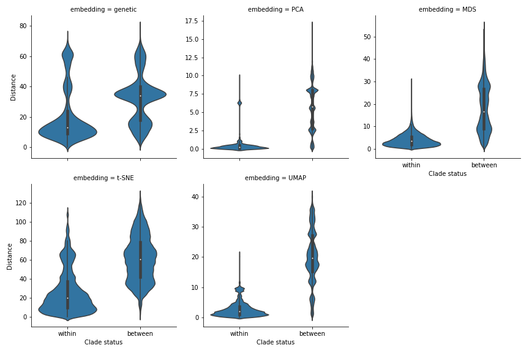
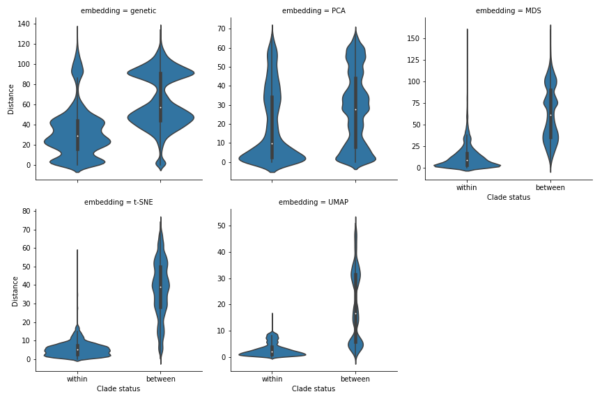

# Links to Graphs/Charts Cartography

## Zika Charts
[MDS Clickable](https://blab.github.io/cartography/MDS.html)\
[PCA Brush](https://blab.github.io/cartography/PCABrush.html)\
[TSNE Clickable](https://blab.github.io/cartography/TSNEClickable.html)\
[TSNE Learning Rates](https://blab.github.io/cartography/TSNELearningRates.html)\
[UMAP Clickable](https://blab.github.io/cartography/UMAPClickable.html)\
[PCA Scaled Clickable](https://blab.github.io/cartography/PCAScaledClickable.html)\

## Flu Charts
[MDS Brush](https://blab.github.io/cartography/MDSFluBrush.html)\
[TSNE Clickable](https://blab.github.io/cartography/TSNEFluClickable.html)\
[PCA Brush](https://blab.github.io/cartography/PCAFluBrush.html)\
[PCA Clickable](https://blab.github.io/cartography/PCAFluClickable.html)\
[UMAP Brush](https://blab.github.io/cartography/UMAPFluBrush.html)\

# DESCRIPTION OF THE PROBLEM:

Phylogenetic inference is a fundamental tool for understanding genealogical relationships among human pathogenic viruses. 
However, recombination and reassortment of viral genomes invalidates basic phylogenetic assumptions of inheritance and requires more sophisticated approaches. 
Some approaches have been to split a genome into multiple phylogenies in order to model the evolution of nonrecombinant fragments by using a genetic algorithm to scan strains for recombination breakpoints, quantifying and analyzing the impact of recombination at each breakpoint, and breaking the phylogeny at the important breakpoints [@kosakovsky_pond_posada_gravenor_woelk_frost_2006]. 
These genetic algorithms for recombination detection include GARD [@kosakovsky_GARD_2006], RDP4 [@martin_murrell_khoosal_muhire_2017], and others. 
Work with different dimensionality reduction techniques and genetic data has also been done; PCA has been used to estimate and model ancestry in unrelated individuals to remove ancestry’s confounding factor in genetic association studies [@alexander_novembre_lange_2009].
Another application of PCA to genetic data from European samples showed that for Europeans where all four grandparents originated in the same country, PCA could map their country of origin quite accurately in a two dimensional map [@GenesMirrorGeography2008].
PCA was also used to reveal Zika’s genetic diversity and spread in the Americas by assessing clustering of multidimensional genetic data[@H.C.109348].
We present a novel approach to understanding relationships among viral genomes by transforming genomic data and then using dimensionality reduction methods such as PCA, MDS, t-SNE, and UMAP.
We evaluate this method by applying it to viruses whose genomes are phylogenetically tractable (we used influenza H3N2 and Zika).
We test this method by applying it to viruses whose genomes are known to undergo substantial recombination, such as MERS, COVID-19, and others. 

Recombination: occurs when at least two viral genomes co-infect the same host cell and exchange genetic segments. 
Shuffling/reassortment, a particular type of recombination, occurs in viruses with segmented genomes, which by interchanging complete genome segments, gives rise to new segment combinations [@pérez-losada_arenas_galán_palero_gonzález-candelas_2014].

[PCA][1]
[MDS][2]
[t-SNE][3]
[U-MAP][4]
[1]: https://www.ncbi.nlm.nih.gov/pmc/articles/PMC4792409/
[2]: https://onlinelibrary.wiley.com/doi/abs/10.1002/wcs.1203
[3]: http://www.jmlr.org/papers/volume9/vandermaaten08a/vandermaaten08a.pdf
[4]: https://arxiv.org/pdf/1802.03426.pdf

# METHODS:

### Materials:

The analysis environment can be recreated using conda and all installation instructions are available on [Cartography’s github](https://github.com/blab/cartography), where cartography.yml already has the modules below to install.

### Methods:
Influenza A/H3N2 and Zika genomes were analyzed, creating a FASTA file of multiple sequence alignments with mafft via augur align and phylogenies with IQ-TREE via augur tree.

This file was then read and translated into 2 arrays using the [BioPython package SeqIO](https://biopython.org/DIST/docs/api/Bio.SeqIO-module.html), where one array held the strain identifiers, and the other the full genome corresponding to the strain identifier.

Two different methods of transforming the data were used; Scaling and centering the data, and a Hamming distance similarity matrix.
For Scaling and Centering the data, PCA was performed on the matrix of nucleotides from the multiple sequence alignment using scikit-learn [@jolliffe_cadima_2016].

The second approach used Hamming distance to create a similarity matrix. 
By comparing every genome with every other genome and clustering based on their pairwise distance, the algorithm takes the overall structure of the multidimensional data and groups together genomes that have similar differences.
This means the data is clustered by genetic diversity (in a phylogenetic tree genetic diversity is categorized using clades).
Each genome was split into separate nucleotides and compared with other nucleotides in the same site on other genomes.
Only a difference between the main nucleotide pairs (AGCT) was counted -- gaps (N) were not.
This is because some sequences were significantly shorter than others, and a shorter strain does not necessarily mean complete genetic dissimilarity, which is what counting gaps implied. 

The similarity matrix was read out to a .csv file to cut processing time. 
The similarity distance matrix was reduced through MDS, t-SNE, and UMAP, plotted using [Altair](https://altair-viz.github.io/) ,and colored by clade assignment.
Clade membership metadata was provided by a .json build of the influenza H3N2 tree (the build can be found at https://github.com/blab/cartography/tree/master/notebooks/Data).
The 3 different dimensionality reduction techniques are ordered below by publication date: 
- [MDS](https://scikit-learn.org/stable/modules/generated/sklearn.manifold.MDS.html)
- [t-SNE](https://scikit-learn.org/stable/modules/generated/sklearn.manifold.TSNE.html)
- [UMAP](https://umap-learn.readthedocs.io/en/latest/)

To further analyze the embeddings’ ability to accurately capture the multidimensional data, two separate plots were made: pairwise vs euclidean distance scatterplots with a LOESS best fit line, and within vs between clade violin plots per embedding.

Pairwise vs euclidean distance scatterplots:
 
Pairwise vs Euclidean distance plots assess the local and global structure of the embedding as well as assess the overall strength of the embedding's recapitulation.
The closer the Pearson Coefficient is to 1, the better the embedding is at preserving genetic dissimilarity in euclidean space.
The LOESS line drawn through the plot assesses the best fit function for the embedding.
To create the plot, the similarity matrix’s upper triangle values were made into a distance matrix where each genome’s distance from another in their respective reduced embedding space was plotted against the pairwise distance between the two genomes.
The pairwise distance was on the x axis, and the euclidean distance was on the y axis.
Linear regression data was calculated from the Pandas Dataframe using [linregress](https://docs.scipy.org/doc/scipy/reference/generated/scipy.stats.linregress.html).

Between vs Within clade Violin plots:

The Between vs Within clade Violin plots assess the strength of the relationship between euclidean distance and clade status of two respective points.
The density of the violin plot at a specific distance gives the relative probability of two strains with that distance being in same or different clades.
The median to median ratio is an indicator of how well the embedding clusters the data.
The larger the ratio between the medians of between vs within clade violin plots, the better the embedding is at clustering and compartmentalizing data into their clades.
To create this plot, the matrix of euclidean distances for each embedding was flattened, and each comparison was labeled as a “within clade” or “between clade” comparison using the clade assignments from the .json build of the tree.
Violin plots were made using [seaborn](https://seaborn.pydata.org/) , separated by clade status and euclidean distance on the y axis.  

# RESULTS:

### EXPECTATIONS FOR PCA, MDS, t-SNE, and UMAP

PCA (Principal Component Analysis) reduces multidimensional data, increasing interpretability while minimizing information loss.
This is done through creating variables that are linear functions of the set that also maximize variance, then solving an eigenvalue/eigenvector problem to reduce the data into less dimensions.[@jolliffe_cadima_2016] 
However, PCA relies on linear assumptions, meaning PCA is focused on finding orthogonal projections that contain the highest variance.
PCA does not affect the scale of the data, and does not normalize the data as part of the algorithm. 
PCA is almost entirely focused on retaining the global structure and variance of the data, and therefore one of its limitations is revealing patterns locally. 
PCA is not an algorithm to be used on a similarity matrix, and is instead intended for transformed and normalized multidimensional data.
In the context of this paper, PCA will be used on transformed and normalized genetic data and not on the similarity matrix described above.
Because PCA retains global structure, few clear clusters different than the overall shape of the phylogenetic tree will be seen. 

MDS (Multidimensional Scaling) refers to statistical techniques that reduce the complexity of a data set by quantifying similarity judgments, increasing interpretability of local relational structures mired in the dataset.
MDS outputs a “map” that spatially conveys the relationships among the items, with dissimilar data points farther away from each other (effectively clustering data based off of similarity). [@hout_papesh_goldinger_2012] 
MDS requires a specific “placement” of each item to find the “true” solution wherein the distances correlate perfectly to the quantified similarity index (which is often impossible - MDS gets as close as possible to this).
Some limitations to MDS include that only one symmetric matrix is allowed as input, and the scale of measurement is ordinal (non numerical).
MDS preserves global patterns over local patterns, but the algorithm’s importance on translating dissimilarity to distance does preserve some larger patterns in local structure as well.
In the context of this paper, MDS will cluster data into sparse “sections” of the map while not creating actual clusters. 
The data’s true global shape will be more important to MDS than these clusters. 

t-SNE (t-distributed Stochastic Neighbor Embedding) visualizes high-dimensional data by giving each datapoint a location in a 2 to 3 dimensional map.
t-SNE is better than other techniques at creating a single map that reveals both local and global patterns in the dataset.
t-SNE uses randomization to analyze the implicit structure of the data, influencing the way in which each subset of the data is displayed in the overall embedding.t-SNE is focused largely on local structure over global structure, and t-SNE’s projection of clusters and distances between clusters are not analogous to dissimilarity - in other words, t-SNE focuses heavily on projecting similarity rather than dissimilarity [@maaten2008visualizing].
Some limitations to t-SNE is the non-convexity of optimization stemming from the existence of multiple local minima and its complex manifolds that, while not a linear projection, makes assumptions about the data that may not be accurate.
t-SNE also reduces data’s dimensionality based on local properties of data, meaning data with intrinsically high dimensional structure will not be projected accurately.
In the context of this paper, t-SNE will create tight clusters that clearly indicate genetic similarity, but will not create an accurate global picture of the data.

UMAP (Uniform Manifold Approximation and Projection) is a manifold learning technique for dimension reduction based in Riemannian geometry and algebraic topology [@lel2018umap].
UMAP is more competitive with t-SNE for visualization quality and preserves more global structure with a much faster run time.
UMAP has no computational restrictions on embedding dimensions, making it largely useful for machine learning.
Some limitations include its lack of maturity - this novel technique does not have firmly established or robust practices and libraries to use UMAP best.
In the context of this paper, UMAP will reveal a tightly clustered set of data that retains both the global structure of the data and the clusters and similarities present at the local level. 

# EXPECTATIONS FOR VIRUSES:

## Influenza:

H3N2 Influenza in this project is used as a proof of concept.
As influenza only reassorts and does not recombine, the genetic diversity of the flu is low enough to create phylogenetic transmission trees per chromosome, and differences between clades is very pronounced.
It can be reasonably assumed that H3N2 influenza is a good test case for Cartography.
One of the chromosomes genetic data (HA) for H3N2 was used for the tree and the corresponding embeddings. 

## SUMMARY OF RESULTS FOR INFLUENZA 

PCA: The data was normalized and scaled, and PCA was run on it (Figure 1).
The PCA pairwise vs euclidean distance plot gave a pearson coefficient of .739, which was the closest coefficient to 1 of the 4 embeddings analyzed.
The data points followed the LOESS line in a fairly linear fashion, which, given that PCA retains global patterns and therefore genetic distances should not differ widely from euclidean distance in the plot, upholds preexisting beliefs about the algorithm (Figure 2).
The ratio between the medians given by the within vs between violin plot for PCA was 24:1, revealing tightly clustered and compartmentalized data (Figure 3).
However, the data did not seem to show any new patterns of information and clustered the data points almost identically to the .json rendering of the tree; similar distance and placement of clade clusters corroborates this hypothesis.

MDS: MDS reduced the pairwise distance matrix (Figure 1).
The MDS pairwise vs euclidean distance plot gave a pearson coefficient of .615, which was the highest of the 3 embeddings that reduced pairwise distance matrix data.
The data points followed the LOESS line in a fairly linear fashion, which, given that MDS favors retaining global patterns over local patterns and therefore genetic distances should not differ widely from euclidean distance in the plot, upholds preexisting beliefs about the algorithm (Figure 2).
The ratio between the medians given by the within vs between violin plot for MDS was 4:1, revealing fairly tightly clustered data.
The data points from different clades did overlap each other, but given that MDS retains global structure, this result is expected.
The higher density of the MDS  between vs within violin plots at lower euclidean distances corroborates this pattern, as it reveals that it is harder to distinguish the between vs within clade measure at lower MDS euclidean distances (Figure 3).
The embedding did translate the data differently than the rendering of the tree, giving more euclidean space between points that were more genetically diverse.
This pattern is clearly shown in the pairwise vs euclidean graph for MDS, as the plateau in the lower genetic distances quickly gives way to a steep incline as euclidean and genetic distance begin to diverge increasingly.

t-SNE: t-SNE reduced the pairwise distance matrix (Figure 1).
The t-SNE pairwise vs euclidean distance plot gave a pearson coefficient of .307, which was the lowest of the 3 embeddings that reduced pairwise distance matrix data.
The data points splayed out from the LOESS line as genetic distance increased along the x axis, which, given that t-SNE favors retaining local patterns over global patterns and therefore euclidean and genetic distance begin to diverge increasingly, upholds preexisting beliefs about the algorithm (Figure 2).
The ratio between the medians given by the within vs between violin plot for t-SNE was 3:1, revealing fairly clustered data.
The data points from different clades did not overlap each other as t-SNE is a locally focused embedding.
The density of the within clade violin plot is at lower euclidean distances than the density of the between clade violin plot, revealing that it is quite easy to distinguish the between vs within clade measure given a euclidean distance (this overall reveals a well clustered and compartmentalized embedding of these data points) (Figure 3).
The embedding did translate the data differently than the rendering of the tree, giving more euclidean space between points that were more genetically diverse.
The t-SNE embedding translated the data and found local clusters previously unseen; one of the clades (A1b/131K) was split into three clusters that, when looking at NextStrain’s updated Ha phylogeny, slices the clade in three clean pieces. Looking at the nextstrain clade, this “slicing” in the dimensionality reduction revealed patterns in the tree that were not seen, and this foreshadows Cartography’s possible competency with pinpointing future clade break points.

UMAP: UMAP reduced the pairwise distance matrix (Figure 1).
The UMAP pairwise vs euclidean distance plot gave a pearson coefficient of .471.
The data points did splay out from the LOESS line, but far less so compared to t-SNE - the more distinguishing characteristics were the clusters shown in the scatter plot itself, revealing UMAP’s approach to visualizing local and global patterns equally (Figure 2).
The ratio between the medians given by the within vs between violin plot for UMAP was 9:1, revealing tightly clustered data.
The data points from different clades were far apart and incredibly densely packed.
The density of the within clade violin plot is at much lower euclidean distances than the density of the between clade violin plot, revealing that it is extremely easy to discern the between vs within clade measure given a euclidean distance (corroborating the observation of UMAP’s densely packed and compartmentalized embedding of these data points) (Figure 3).
The embedding did translate the data differently than the rendering of the tree, giving much more euclidean space between points that were more genetically diverse and packing genetically similar strains very close together, if not stacked.
This pattern is clearly shown in the pairwise vs euclidean graph for UMAP, as the LOESS line begins to plateau as the genetic distance gets larger and larger, revealing that UMAP sets a threshold for genetic diversity and keeps points above that threshold very far apart in euclidean space.
This is different from other embeddings, because PCA, MDS, and t-SNE do not set a threshold for genetic diversity, and instead scale the data based on the largest genetic distance disparity (this makes UMAP’s embedding so densely clustered).

## Figure One

<iframe src="https://blab.github.io/cartography/FullLinkedChartClickableFlu.html" style="width: 1200px; height: 400px;" frameBorder="0"></iframe>

## Figure Two

## Figure Three

## Zika:

Zika: Zika in this project is used as a test case. 
As zika genes all exist on the same genome and zika’s genome is considerably longer than H3N2 Influenza genome, the genetic diversity of zika, while low enough to create phylogenetic transmission tree, clades are hard to distinguish from each other - zika transmission trees are often colored by region and country for this reason. 
It can be reasonably assumed that zika is a good test case for Cartography.

## SUMMARY OF RESULTS FOR ZIKA: 

PCA: The data was normalized and scaled, and PCA was run on it (Figure 4). 
The PCA pairwise vs euclidean distance plot gave a pearson coefficient of .005, which was the lowest coefficient of the 4 embeddings analyzed. 
The data points did not have any correlation to each other, meaning the data showed no signs of clustering at all (Figure 5). 
The ratio between the medians given by the within vs between violin plot for PCA was 1:1, meaning there is no distinction between between clade and within clade distance, corroborating previous conclusions (Figure 6).

MDS: MDS reduced the pairwise distance matrix (Figure 4). 
The MDS pairwise vs euclidean distance plot gave a pearson coefficient of .878, which was the highest of the 4 embeddings. 
The data points followed the LOESS line in an extremely linear fashion, which, given that MDS favors retaining global patterns over local patterns and therefore genetic distances should not differ widely from euclidean distance in the plot, upholds preexisting beliefs about the algorithm (Figure 5). 
The ratio between the medians given by the within vs between violin plot for MDS was 7:1, revealing very tightly clustered data. 
Some data points from different clades did overlap each other, but given that MDS retains global structure, this result is expected.
The density of the within clade violin plot is at lower euclidean distances than the density of the between clade violin plot, revealing that it is quite easy to distinguish the between vs within clade measure given a euclidean distance (Figure 6). 
MDS translated genetic distance to euclidean distance exactly - this pattern is clearly shown in the pairwise vs euclidean graph for MDS, as the LOESS line and the data points surrounding it have a linear 1:1 relationship between genetic and euclidean distance.
t-SNE: t-SNE reduced the pairwise distance matrix (Figure 4). 
The t-SNE pairwise vs euclidean distance plot gave a pearson coefficient of .530, which was the lowest of the 3 embeddings that reduced pairwise distance matrix data. 
The data points splayed out from the LOESS line as genetic distance increased along the x axis, which, given that t-SNE favors retaining local patterns over global patterns and therefore euclidean and genetic distance begin to diverge increasingly, upholds preexisting beliefs about the algorithm (Figure 5). 
The Euclidean vs Genetic distance scatter plot grows in a linear fashion until it plateaus, meaning that after a certain genetic distance all euclidean distances are similar. 
The ratio between the medians given by the within vs between violin plot for t-SNE was 7:1, revealing very clustered data. 
The data points from different clades did not overlap each other very much as t-SNE is a locally focused embedding. 
The density of the within clade violin plot is at lower euclidean distances than the density of the between clade violin plot, revealing that it is quite easy to distinguish the between vs within clade measure given a euclidean distance (this overall reveals a well clustered and compartmentalized embedding of these data points) (Figure 6). 
The embedding did translate the data differently than the rendering of the tree, giving less euclidean space between points that were more genetically diverse, and creating a “threshold” for how much genetic diversity would impact euclidean distance. 

UMAP: UMAP reduced the pairwise distance matrix (Figure 4). 
The UMAP pairwise vs euclidean distance plot gave a pearson coefficient of .753. 
The data points did splay out from the LOESS line, but far less so compared to t-SNE - the more distinguishing characteristics were the clusters shown in the scatter plot itself that highlights UMAP’s stepwise approach to clustering - UMAP places much more distance between genetically diverse strains than the global embedding as UMAP visualizes local and global patterns equally (Figure 5). 
The ratio between the medians given by the within vs between violin plot for UMAP was 7:1, revealing tightly clustered data. 
The data points from different clades were far apart and incredibly densely packed when similar. The density of the within clade violin plot is at much lower euclidean distances than the density of the between clade violin plot, revealing that it is quite easy to discern the between vs within clade measure given a euclidean distance (Figure 6).
The embedding did translate the data differently than the rendering of the tree, giving much more euclidean space between points that were more genetically diverse and packing genetically similar strains very close together, if not stacked. 
This is different from other embeddings, because PCA, MDS, and t-SNE scale the data based on the largest genetic distance disparity instead of UMAP’s ability to scale more euclidean distance between points very genetically dissimilar (scaling euclidean distance exponentially compared to genetic distance).

## Figure 4
<iframe src="https://blab.github.io/cartography/FullLinkedChartClickableZika.html" style="width: 1200px; height: 400px;" frameBorder="0"></iframe>

## Figure 5

## Figure 6

## SUMMARY OF RESULTS ACROSS VIRUSES

Overall, the best recapitulation of the phylogenetic clades of the four analyzed was that of MDS and UMAP, because they preserved the most local and global structure. 
However, t-SNE separated clusters much better than MDS as lots of the points were layered on top of each other in the MDS embedding (clade A1b/131K in H3N2 Influenza was impossible to see in MDS clusters 1 and 2). 

Of the 3 embeddings that reduced the pairwise distance matrix, as the focus of the algorithms shifted more towards preserving local structure over global structure, the closer the Pearson Coefficient got to 0 (MDS > UMAP > t-SNE). 
Pearson Coefficient studies the effectiveness of an embedding at preserving a relationship between genetic and euclidean distance, so for t-SNE, an algorithm that focuses primarily on exaggerating distances and clusters locally to convey patterns, the pearson coefficient is going to be closer to 0, as the data points will not adhere to a best fit line. 
For MDS, however, the embedding relies almost entirely on creating an exact 1:1 genetic:euclidean relationship, so the pearson coefficient was much higher. 
In the same vein, as the algorithms shifted towards retaining local patterns over global patterns, the disparity between the densities of the between vs within violin plots became more pronounced. 
Because the violin plots assess an embedding’s ability to distinguish between clades (how clustered the embedding is), the more exaggerated the differences between euclidean and genetic distance, the more disparate the densities are. 
t-SNE’s within clade violin plot had the most concentrated density at around 5, and its between clade violin plot had the most concentrated density at around 45. By comparison, the genetic distance within:between was 45:60.  

# Works Cited
