# Links to Graphs/Charts Cartography

## Zika Charts
[MDS Clickable](https://blab.github.io/cartography/MDS.html)\
[PCA Brush](https://blab.github.io/cartography/PCABrush.html)\
[TSNE Clickable](https://blab.github.io/cartography/TSNEClickable.html)\
[TSNE Learning Rates](https://blab.github.io/cartography/TSNELearningRates.html)\
[UMAP Clickable](https://blab.github.io/cartography/UMAPClickable.html)\
[PCA Scaled Clickable](https://blab.github.io/cartography/PCAScaledClickable.html)\

## Flu Charts
[MDS Brush](https://blab.github.io/cartography/MDSFluBrush.html)\
[TSNE Clickable](https://blab.github.io/cartography/TSNEFluClickable.html)\
[PCA Brush](https://blab.github.io/cartography/PCAFluBrush.html)\
[PCA Clickable](https://blab.github.io/cartography/PCAFluClickable.html)\
[UMAP Brush](https://blab.github.io/cartography/UMAPFluBrush.html)\

# DESCRIPTION OF THE PROBLEM:

Nextstrain.com can only handle diseases that have clear phylogenies, or where the virus’ ancestry is easy to track through time. However, multiple diseases, such as enterovirus, bacteria, and malaria, recombine and are therefore their phylogenies are usually split at the chromosomal level, making it hard to hypothesize the entire diseases ancestry and location throughout time. The project is to create an interactive tool that uses different embeddings of genetic sequence data via PCA, MDS, t-SNE and U-MAP to identify patterns and relationships that aren't seen in phylogenies due to this recombination issue. The overall goal would be to integrate this tool into Nextstrain in the future.

Recombination: Recombination is a process usually during meiosis where pieces of DNA are broken and recombined into the chromosome to produce new combinations of alleles. This process creates genetic diversity in the DNA sequences of different organisms.

** PCA, MDS, t-SNE, U-MAP (Should I define each other these/ link their documentation?)

# METHODS:

### Materials:
The Modules and dependencies necessary to run this code well as instructions are on Cartography’s github (https://github.com/blab/cartography), where cartography.yml already has the modules below to install.
- pip
- seaborn
- altair
- pandas
- numpy
- biopython
- python>=3.6
- scikit-learn
- umap-learn
- jsonschema
- jupyterlab
- nextstrain-augur

[Docker](https://www.docker.com/) is also needed to run the tree builds, but to install this a computer must have certain software. More detailed instructions can be found on the website linked above. To run the code on Cartography, however, Docker is not necessary. 

### Methods:
A tree build was run using nextstrain-cli for influenza H3N2 to obtain genomic data. An aligned FASTA file was created in the results folder of the flu tree build. The build can be found at [Fauna](https://github.com/nextstrain/fauna/tree/master/builds) under "FLU" (instructions on running the build are also housed there). The created FASTA file is available [here](https://github.com/blab/cartography/tree/master/notebooks/Data) for free use. This file was then read and translated into 2 arrays using the [BioPython package SeqIO](https://biopython.org/DIST/docs/api/Bio.SeqIO-module.html), where one array held the strain identifiers, and the other the full genome corresponding to the strain identifier.

Two different methods of transforming the data were used; Scaling and centering the data, and a Hamming distance similarity matrix. For Scaling and Centering the data, each site on the genome was treated as a different dimension, and the probability (called p) of having a certain nucleotide in that site given the frequency of that nucleotide acid at that site among all genomes was plotted. This approach was modeled after the equation below where C is the dimensional matrix, M is the mean, and p is the frequency of a nucleotide at that given site:

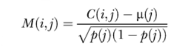

Matrix M was plotted using [scikit-learn’s PCA](https://scikit-learn.org/stable/modules/generated/sklearn.decomposition.PCA.html) .

The second approach used Hamming distance to create a similarity matrix. By comparing every genome with every other genome and clustering based on their pairwise distance, the algorithm takes the overall structure of the multidimensional data and groups together genomes that have similar differences. This means the data is clustered by genetic diversity (in the phylogenetic tree genetic diversity is categorized using clades). Each genome was split into separate nucleotides and compared with other nucleotides in the same site on other genomes. Only a difference between the main nucleotide pairs (AGCT) was counted -- gaps (N) were not. This is because some sequences were significantly shorter than others, and a shorter strain does not necessarily mean complete genetic dissimilarity, which is what counting gaps implied. An illustration follows below to demonstrate this process. 

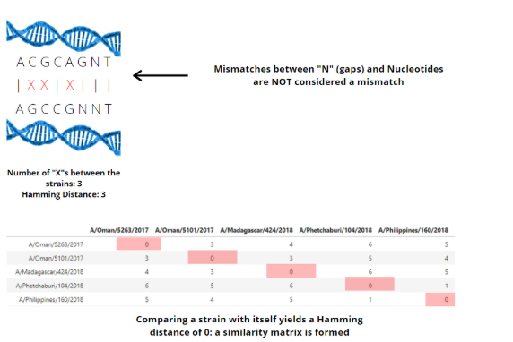

The similarity matrix was read out to a .csv file to cut processing time. The similarity distance matrix was reduced through MDS, t-SNE, and UMAP, plotted using [Altair](https://altair-viz.github.io/) ,and colored by clade assignment. Clade membership metadata was provided by a .json build of the influenza H3N2 tree (the build can be found at https://github.com/blab/cartography/tree/master/notebooks/Data) . The 3 different dimensionality reduction techniques are ordered below by algorithmic complexity: 
- [MDS](https://scikit-learn.org/stable/modules/generated/sklearn.manifold.MDS.html)
- [t-SNE](https://scikit-learn.org/stable/modules/generated/sklearn.manifold.TSNE.html)
- [UMAP](https://umap-learn.readthedocs.io/en/latest/basic_usage.html)

To further analyze the embeddings’ ability to accurately capture the multidimensional data, two separate plots were made: pairwise vs euclidean distance scatterplots with a LOESS best fit line, and within vs between clade violin plots per embedding.

Pairwise vs euclidean distance scatterplots:
 
Pairwise vs Euclidean distance plots assess the local and global structure of the embedding as well as assess the overall strength of the embedding's recapitulation. The similarity matrix’s upper triangle values are made into a flattened numpy array using [numpy.triu_indices()](https://docs.scipy.org/doc/numpy-1.13.0/reference/generated/numpy.triu_indices.html) and joined with a flattened numpy array of euclidean distances between each embedding’s coordinate points in a Pandas Dataframe. This dataframe is plotted using seaborn and [statsplots’ LOESS function](https://www.statsmodels.org/stable/generated/statsmodels.nonparametric.smoothers_lowess.lowess.html) . This data was made into a distance matrix as well, where each genome’s distance from another in the reduced space was plotted against the pairwise distance between the two genomes. The pairwise distance was on the x axis, and the euclidean distance was on the y axis. Linear regression data was calculated from the Pandas Dataframe using [linregress](https://docs.scipy.org/doc/scipy/reference/generated/scipy.stats.linregress.html).

Between vs Within clade Violin plots:

The Between vs Within clade Violin plots assess the strength of the relationship between euclidean distance and clade status of two respective points. The density of the violin plot gives the relative probability that the two strains at a given distance are in the same or different clades. The matrix of euclidean distances for each embedding was flattened, and each comparison was labeled as a “within clade” or “between clade” comparison using the clade assignments from the .json build of the tree. Violin plots were made using [seaborn](https://seaborn.pydata.org/) , separated by clade status and euclidean distance on the y axis.  

# RESULTS:

Scaling and Centering the Data

Influenza:

- Because PCA (Principal Component Analysis) reduces multidimensional data and not distance matrices, PCA was used to analyze the data in this format. While the ratio given by the within vs between violin plot was 24:1 and a positive R^2 correlation of .739, revealing a tightly clustered set of data, the data was not transformed to show any new pattern or information, and clustered the data almost identically to the .json rendering of the tree.
<iframe src="https://blab.github.io/cartography/PCAFluBrush.html" style="width: 1200px; height: 400px;" frameBorder="0"></iframe>

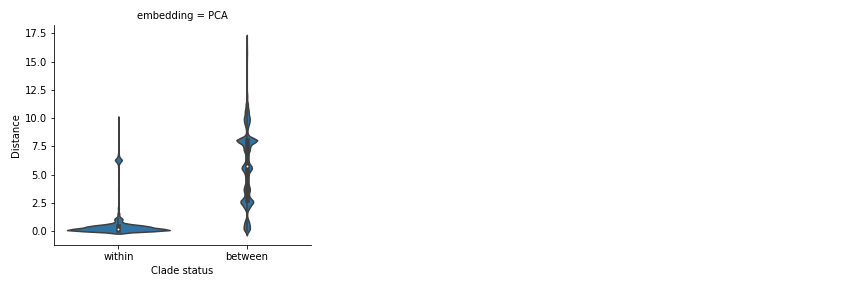
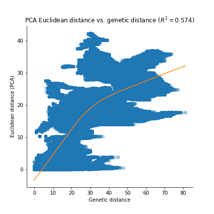

### Zika:

- The Ratio given by the within vs between violin plot was 1:1 and a R^2 correlation of .011, revealing data not clustered at all. The chart reflects this, having no pattern whatsoever. 

<iframe src="https://blab.github.io/cartography/PCAZikaBrush.html" style="width: 1200px; height: 400px;" frameBorder="0"></iframe>

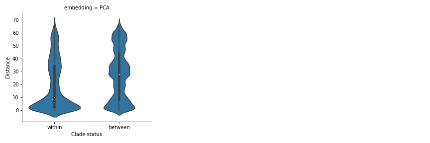
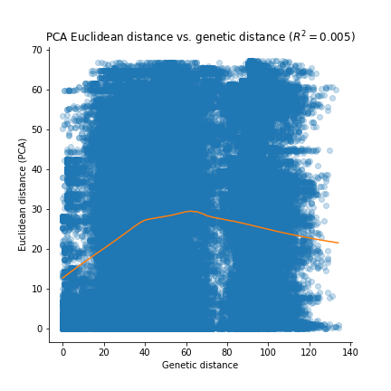

Pairwise distance between genomes

### Influenza:

The pairwise distance matrix was reduced using MDS, t-SNE, and UMAP. The MDS between vs within clade graph' violin plots have a median to median ratio of 4, which correlates to a significant difference in density at a given distance (on the y). This difference indicates that the embedding is fairly clustered and accurate at placing strains in the correct clade. Comparing the pairwise vs euclidean scatterplots of these three embeddings, it can be seen that MDS's Cluster 1 and 2 Pearson Coefficient was the highest of them (r = .723), sugesting the data is best correlated using MDS. The points on the scatterplot start out fairly concentrated at the origin, and continually get more spread out, which is an indicator that MDS is a local, rather than global, reduction technique. Locally preserving techniques focus more heavily on on retaining distances and structure on a smaller scale, usually within a cluster, and focuses less on retaining the "global" appearance of the data. 

<iframe src="https://blab.github.io/cartography/MDSFluBrush.html" style="width: 1200px; height: 400px;" frameBorder="0"></iframe>
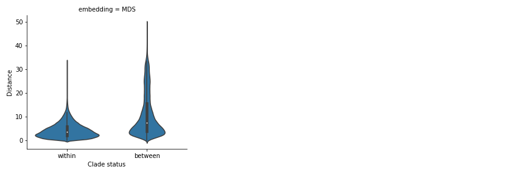
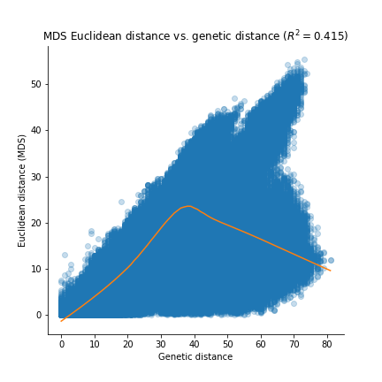

The same pattern is observed with t-SNE to a much larger extent, as the points begin to spread out from the line of best fit much earlier on than MDS. t-SNE's between vs within clade violin plots have a median to median ratio of 3, meaning while it is less accurate at placing a strain within its correct clade than MDS, it is still a fairly clear indicator of within vs between clade status based off of the euclidean distance between two points. 

<iframe src="https://blab.github.io/cartography/TSNEFluBrush.html" style="width: 1200px; height: 400px;" frameBorder="0"></iframe>
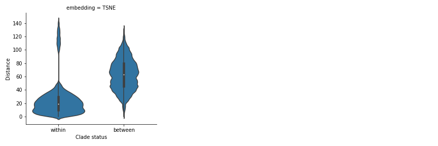

UMAP is a techinique aimed at preserving both local and global structure, and this is relected in the fairly linear spread of UMAP's genetic vs euclidean scatter plot. While the points do spread out as the pairwise distance gets larger, the points stay fairly concentrated in a set distance from the best fit line. UMAP's violin plot has a median to median ratio of 9, reflecting a densely clustered and highly accurate embedding at placing strains in their correct clade. UMAP's within clade violin plot's density is concentrated at a lower euclidean distance, further illustrating UMAP's tightly clustered embedding.  

<iframe src="https://blab.github.io/cartography/UMAPFluBrush.html" style="width: 1200px; height: 400px;" frameBorder="0"></iframe>
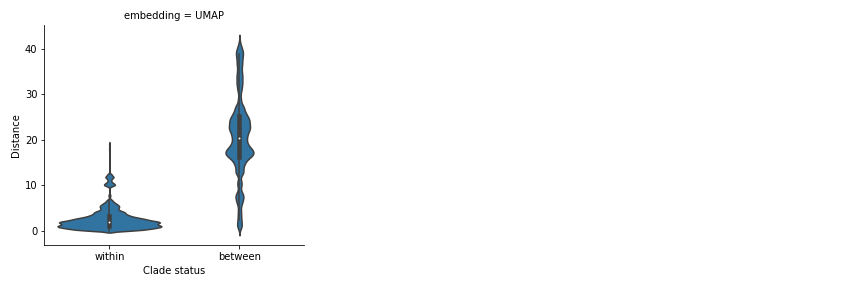
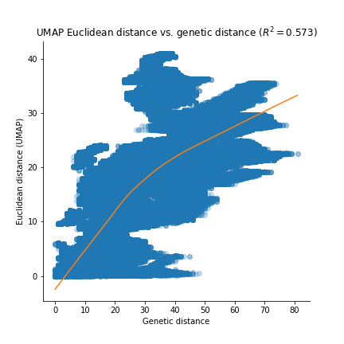

Pairwise distance matrix of genome values worked best for creating plots with clusterings that revealed later patterns with clades. In the t-SNE embedding for influenza, the clade A1b/131K is split into three clusters that also appear to slice the tree in three clean pieces. Looking at the tree, this "slicing" seems to have revealed patterns in the tree that were not seen in the tree until a later build. UMAP to some degree also shows this pattern. 

<iframe src="https://blab.github.io/cartography/TSNEUMAPClickableFlu.html" style="width: 1200px; height: 400px;" frameBorder="0"></iframe>
 
Overall, the best recapitulation of the phylogenetic clades of the four analyzed was that of MDS and UMAP, because they preserved more local and global structure. However, t-SNE did better at separating clusters than MDS, as in MDS, lots of the points were layered on top of each other (clade A1b/131K was impossible to see in clusters 1 and 2). This makes sense, as the MDS algorithm largely makes its mapping with respect to between-object distances - local structure is preserved but not global. 
t-SNE clustered genetically similar clades well, but did not place similar clusters next to each other (t-SNE has a large focus on local structure while still maintaining some global structure (presence of multiple scales of clusters))

# Tree Linked Flu Chart with PCA, MDS, TSNE, and UMAP

<iframe src="https://blab.github.io/cartography/FullLinkedChartClickable.html" style="width: 1700px; height: 850px;" frameBorder="0"></iframe>
